> 记录自己的 SpringCloud 的学习过程，从 2025年9月21日开始。

[toc]

# 0.分布式简述

部署一个项目，一般有三种方式：

1. 单体架构
2. 集群架构
3. 分布式架构

## 0.1. 单体架构

单体机构的基本逻辑走向是：

用户访问域名，自动转到绑定了这个域名的公网 IP 地址，我们的应用程序就部署在一个公网 IP 之中。

他的优点是：建立简单。

他的缺点是：一旦应用的并发量过大，就会产生问题。

## 0.2 集群架构

集群架构的基本逻辑走向是：

用户访问域名，自动转到绑定了这个域名的 公网 IP 地址，这个 IP 地址上部署了一个网关，一般是使用 Nginx，他能分配不用的用户，前往不同的服务器，这些服务器上分别都部署了我们的应用程序。

他的优点是：解决了单体架构高并发可能产生的宕机危险。

他的缺点是：不能模块化升级维护项目，且不支持一个项目用多个语言编写

## 0.3 分布式架构

分布式架构的基本逻辑走向是：

用户访问域名，自动转到绑定了这个域名的 公网 IP 地址，这个 IP 地址上部署了一个网关，一般是使用 Nginx，他能分配不用的用户，前往不同的服务器，这些服务器上分别都部署了我们的应用程序的某个或多个功能模块。

他的优点是：解决了单体架构高并发可能产生的宕机危险。同时解决了集群架构的缺点，每个业务模块与模块之间相互独立，支持多种语言编写。

# 1. 第一个微服务程序

## 1.1. 确定项目版本

1. 框架版本

   | SpringBoot | SpringCloud | SpringCloud Alibaba |
   | ---------- | ----------- | ------------------- |
   | 3.3.4      | 2023.0.3    | 2023.0.3.2          |

2. 组件版本

   | Nacos | Sentinel | Seata |
   | ----- | -------- | ----- |
   | 2.4.3 | 1.8.8    | 2.1.0 |

## 1.2. 创建 SpringBoot 项目

直接创建新的 SpringBoot 项目，取名 `cloud-demo`，创建完成之后删掉除了 `.idea` 文件夹 和 `pom.xml` 之外的所有文件。并将 `pom.xml` 文件修改为：

```xml
<?xml version="1.0" encoding="UTF-8"?>
<project xmlns="http://maven.apache.org/POM/4.0.0" xmlns:xsi="http://www.w3.org/2001/XMLSchema-instance"
         xsi:schemaLocation="http://maven.apache.org/POM/4.0.0 https://maven.apache.org/xsd/maven-4.0.0.xsd">
    <modelVersion>4.0.0</modelVersion>
    <parent>
        <groupId>org.springframework.boot</groupId>
        <artifactId>spring-boot-starter-parent</artifactId>
        <!--确定 SpringBoot 的版本-->
        <version>3.3.4</version>
        <relativePath/>
    </parent>
    <!--确定打包方式-->
    <packaging>pom</packaging>
    <groupId>com.sangui</groupId>
    <artifactId>cloud-demo</artifactId>
    <version>0.0.1-SNAPSHOT</version>
    <name>cloud-demo</name>
    <description>cloud-demo</description>
    <!--添加依赖配置信息-->
    <properties>
        <maven.compiler.source>21</maven.compiler.source>
        <maven.compiler.target>21</maven.compiler.target>
        <project.build.sourceEncoding>UTF-8</project.build.sourceEncoding>
        <spring-cloud.version>2023.0.3</spring-cloud.version>
        <spring-cloud-alibaba.version>2023.0.3.2</spring-cloud-alibaba.version>
    </properties>
    <!--添加依赖-->
    <dependencyManagement>
        <dependencies>
            <dependency>
                <groupId>org.springframework.cloud</groupId>
                <artifactId>spring-cloud-dependencies</artifactId>
                <version>${spring-cloud.version}</version>
                <type>pom</type>
                <scope>import</scope>
            </dependency>
            <dependency>
                <groupId>com.alibaba.cloud</groupId>
                <artifactId>spring-cloud-alibaba-dependencies</artifactId>
                <version>${spring-cloud-alibaba.version}</version>
                <type>pom</type>
                <scope>import</scope>
            </dependency>
        </dependencies>
    </dependencyManagement>

    <build>
        <plugins>
            <plugin>
                <groupId>org.springframework.boot</groupId>
                <artifactId>spring-boot-maven-plugin</artifactId>
            </plugin>
        </plugins>
    </build>

</project>
```

## 1.3. 创建 services 模块

为项目添加新的模块，添加普通的 Java 模块，取名 `services`。这就是微服务模块。

删除改模块里的 `src` 文件夹，并修改该模块的打包方式为 `pom`，如：

```xml
<?xml version="1.0" encoding="UTF-8"?>
<project xmlns="http://maven.apache.org/POM/4.0.0"
         xmlns:xsi="http://www.w3.org/2001/XMLSchema-instance"
         xsi:schemaLocation="http://maven.apache.org/POM/4.0.0 http://maven.apache.org/xsd/maven-4.0.0.xsd">
    <modelVersion>4.0.0</modelVersion>
    <parent>
        <groupId>com.sangui</groupId>
        <artifactId>cloud-demo</artifactId>
        <version>0.0.1-SNAPSHOT</version>
    </parent>

    <!--设置打包方式-->
    <packaging>pom</packaging>

    <artifactId>services</artifactId>

    <properties>
        <maven.compiler.source>21</maven.compiler.source>
        <maven.compiler.target>21</maven.compiler.target>
        <project.build.sourceEncoding>UTF-8</project.build.sourceEncoding>
    </properties>

</project>
```

未来可在此 `pom.xml` 文件中加入依赖，每个具体的微服务模块都可以使用这个依赖（继承父依赖）。

## 1.4. 创建具体的微服务模块

在 services 里添加具体的微服务模块模块：`service-product`，该模块也是普通的 Java 模块。同样的道理，再添加一个 `service-order` 模块。

# 2. Nacos

**Nacos** 的全称是 Dynamic **Na**ming and **Co**nfiguration **S**ervice ，一个更易于构建云原生应用的**动态服务发现**、**配置管理**和**服务管理**平台，其官网为：https://nacos.io/ 。

## 2.1 Nacos 下载

下载地址：https://nacos.io/download/nacos-server/ 。选择版本为 2.4.3 的二进制包下载。

## 2.2. 启动 Nacos

下载好的 zip 包解压后即可启动。进入此文件夹的 bin 目录下，执行以下命令（Win 环境）即可以单机模式启动 Nacos：

```cmd
startup.cmd -m standalone
```

打开浏览器，输入：http://localhost:8848/nacos/ ，即可访问 Nacos，如下图。

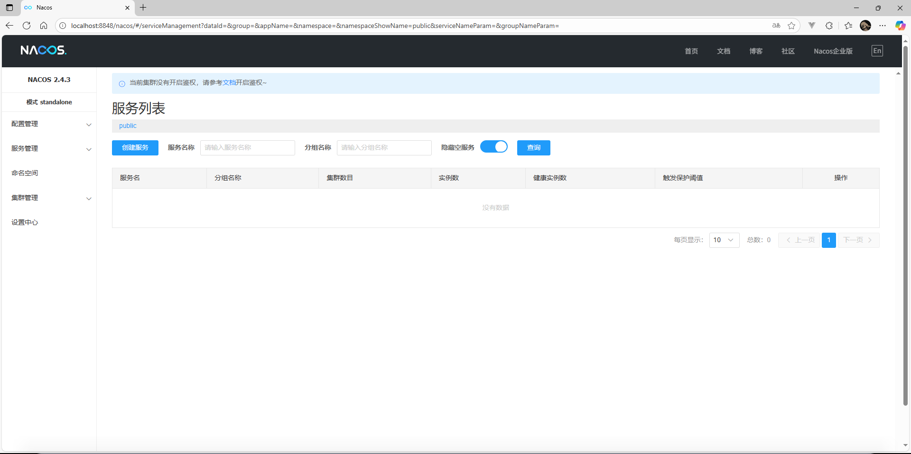

其中里面最重要的两个菜单就是 `配置管理` 和 `服务管理`。配置管理是作为配置中心，服务管理是作为注册中心。

## 2.3. Nacos 的功能——服务注册

+ **Step1 启动微服务**

  1. 引入依赖

     + spring-cloud-starter-alibaba-nacos-discovery

       在父服务中引入此依赖，子服务中因为继承关系，也会默认引入，无需再手动引入。

       ```xml
       <!--服务发现-->
       <dependency>
           <groupId>com.alibaba.cloud</groupId>
           <artifactId>spring-cloud-starter-alibaba-nacos-discovery</artifactId>
       </dependency>
       ```

     +  spring-boot-starter-web

       在子服务中引入 web 依赖

       ```xml
       <dependency>
           <groupId>org.springframework.boot</groupId>
           <artifactId>spring-boot-starter-web</artifactId>
       </dependency>
       ```

  2. 编写微服务的主入口程序

     ```java
     package com.sangui.order;
     
     
     import org.springframework.boot.SpringApplication;
     import org.springframework.boot.autoconfigure.SpringBootApplication;
     
     /**
      * @Author: sangui
      * @CreateTime: 2025-09-21
      * @Description: 订单微服务的主入口程序
      * @Version: 1.0
      */
     @SpringBootApplication
     public class OrderMainApplication {
         public static void main(String[] args) {
             SpringApplication.run(OrderMainApplication.class, args);
         }
     }
     ```

  3. 编写 yaml 配置文件

     ```yaml
     spring:
       application:
         # 设置这个微服务项目的项目名
         name: service-order
       cloud:
         nacos:
           # 配置 Nacos 地址，不配置也行，默认就是本地的 8848 端口
           server-addr: 127.0.0.1:8848
     
     server:
       # 设置这个微服务项目的端口号
       port: 8000
     ```

  至此，即可启动 order-server 这个微服务了。

+ **Step2 查看注册中心效果**

  打开浏览器，输入：http://localhost:8848/nacos/ ，查看`服务管理`的`服务列表`，即可看到刚刚注册的微服务了，如下图：

  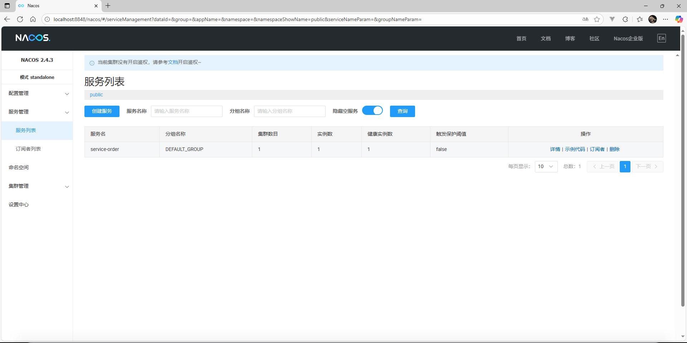

  同样的步骤，为 `service-product` 这个服务，也注册启动，注意修改服务的端口号，再次查看 Nacos，就可以看到注册的两个微服务了，如下图：

  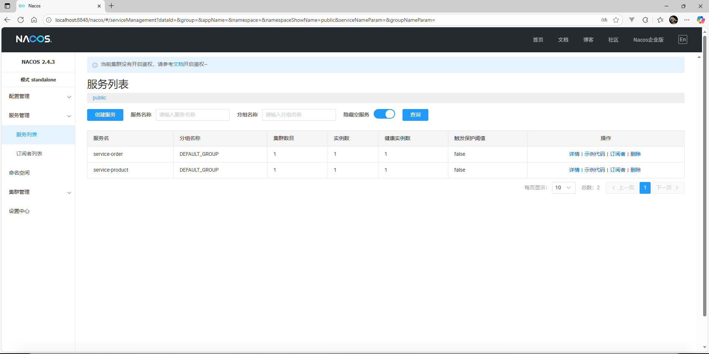

+ **Step3 集群模式启动测试**

  单机情况下可以通过改变端口号模拟微服务集群，那么，我们可以复制一个 OrderMainApplication 服务，并修改这个 OrderMainApplication 的端口，但不修改该服务的项目名。

  修改该服务端口的方法为：配置环境时修改选项，增加 `Program arguments` ， 在程序参数中输入不一样的端口号，如：

  ```
  --server.port=8001
  ```

  启动这个新的服务之后，照此操作，我又新建了若干个实例，server-order 我总共建立了两个实例，端口号分别是 8000 和 8001，server-product 我总共建立了三个实例，端口号分别是 9000、9001 和 9002。

  我们再去 Nacos 的服务列表看，看到 server-order 的服务的实例数就变成了 2 个，server-product 的服务的实例数就变成了 3 个，如下图：
  
  

我们还可以点击某个服务的详情，里面记录了这个服务的每个实例信息，包括该实例的 IP、端口号、项目名

## 2.4. Nacos 的功能——服务发现

+ **Step1 开启服务发现功能**

  在微服务的入口程序中使用 @EnableDiscoveryClient 注解，即可开启微服务的发现功能，如：

  ```java
  package com.sangui.product;
  
  
  import org.springframework.boot.SpringApplication;
  import org.springframework.boot.autoconfigure.SpringBootApplication;
  import org.springframework.cloud.client.discovery.EnableDiscoveryClient;
  
  /**
   * @Author: sangui
   * @CreateTime: 2025-09-21
   * @Description: 产品微服务的主入口程序
   * @Version: 1.0
   */
  // 开启服务发现功能
  @EnableDiscoveryClient
  @SpringBootApplication
  public class ProductMainApplication {
      public static void main(String[] args) {
          SpringApplication.run(ProductMainApplication.class, args);
      }
  }
  ```

+ **Step2 测试服务发现的 DiscoveryClient**

  1. 加入测试依赖

     ```xml
     <dependency>
         <groupId>org.springframework.boot</groupId>
         <artifactId>spring-boot-starter-test</artifactId>
         <scope>test</scope>
     </dependency>
     ```

  2. 写测试程序

     ```java
     package com.sangui.product;
     
     
     import jakarta.annotation.Resource;
     import org.junit.jupiter.api.Test;
     import org.springframework.boot.test.context.SpringBootTest;
     import org.springframework.cloud.client.ServiceInstance;
     import org.springframework.cloud.client.discovery.DiscoveryClient;
     
     import java.util.List;
     
     /**
      * @Author: sangui
      * @CreateTime: 2025-09-22
      * @Description: 测试服务发现
      * @Version: 1.0
      */
     @SpringBootTest
     public class DiscoveryTest {
         // 自动注入即可
         @Resource
         DiscoveryClient discoveryClient;
     
         /**
          * 测试 DiscoveryClient
          */
         @Test
         void discoveryClientTest() {
             // 遍历打印所有微服务
             for (String service : discoveryClient.getServices()) {
                 System.out.println("MyService:" + service);
                 /*
                 上述打印结果：
                 MyService:service-order
                 MyService:service-product
                  */
     
                 // 获取某一个微服务的所有实例
                 List<ServiceInstance> instances = discoveryClient.getInstances(service);
                 for (ServiceInstance instance : instances) {
                     System.out.println("该微服务的名字是：" + service + "，该实例 IP 为：" + instance.getHost() + "，端口号为：" + instance.getPort());
                     /*
                     上述打印结果：
                     该微服务的名字是：service-order，该实例 IP 为：192.168.28.1，端口号为：8001
                     该微服务的名字是：service-order，该实例 IP 为：192.168.28.1，端口号为：8000
                     该微服务的名字是：service-product，该实例 IP 为：192.168.28.1，端口号为：9000
                     该微服务的名字是：service-product，该实例 IP 为：192.168.28.1，端口号为：9001
                     该微服务的名字是：service-product，该实例 IP 为：192.168.28.1，端口号为：9002
                      */
                 }
             }
         }
     }
     ```

+ **Step3 测试服务发现的 NacosServiceDiscovery**

  除了使用 SpringCloud 自带的 API，还可以使用 Nacos 提供的 API，即 NacosServiceDiscovery。

  ```java
  @Resource
  NacosServiceDiscovery nacosServiceDiscovery;
  
  @Test
  void nacosDiscoveryClientTest() throws NacosException {
      // 遍历打印所有微服务
      for (String service : nacosServiceDiscovery.getServices()) {
          System.out.println("MyService:" + service);
          /*
          上述打印结果：
          MyService:service-order
          MyService:service-product
           */
  
          // 获取某一个微服务的所有实例
          List<ServiceInstance> instances = nacosServiceDiscovery.getInstances(service);
          for (ServiceInstance instance : instances) {
              System.out.println("该微服务的名字是：" + service + "，该实例 IP 为：" + instance.getHost() + "，端口号为：" + instance.getPort());
              /*
              上述打印结果：
              该微服务的名字是：service-order，该实例 IP 为：192.168.28.1，端口号为：8001
              该微服务的名字是：service-order，该实例 IP 为：192.168.28.1，端口号为：8000
              该微服务的名字是：service-product，该实例 IP 为：192.168.28.1，端口号为：9000
              该微服务的名字是：service-product，该实例 IP 为：192.168.28.1，端口号为：9001
              该微服务的名字是：service-product，该实例 IP 为：192.168.28.1，端口号为：9002
               */
          }
      }
  }
  ```

  这里的测试的代码几乎和 DiscoveryClient 的代码一模一样，只是把注入的对象换成了 nacosDiscoveryClient，加了异常抛出，具体 API 是一样的。

其实在之后的实际情况中，我们其实无需底层调用这些代码，之后的`远程调用`用到的`服务发现`功能，会封装化为自动化的过程，无需我们手动写。唯一要记住的就是，所有的微服务都可以加入 @EnableDiscoveryClient 注解，这样之后微服务才能发现别的微服务，之间才可以互相调用。

## 2.5. Nacos ——编写微服务 API

这里，通过一个简单的例子，来学习我们的编写微服务的 API。我们的例子是订单和商品两个微服务之间的关联。订单的实体类中包含商品列表，也就是是说一个订单对应这多个商品，订单需要商品提供商品信息来确定订单总额，商品单独存在则无意义，现在让这两个微服务之间相互联系。

1. 独自编写好 product 服务

   ```java
   package com.sangui.product.controller;
   
   
   import com.sangui.product.bean.Product;
   import com.sangui.product.service.ProductService;
   import jakarta.annotation.Resource;
   import org.springframework.web.bind.annotation.GetMapping;
   import org.springframework.web.bind.annotation.PathVariable;
   import org.springframework.web.bind.annotation.RequestParam;
   import org.springframework.web.bind.annotation.RestController;
   
   /**
    * @Author: sangui
    * @CreateTime: 2025-09-22
    * @Description: 商品的 Controller
    * @Version: 1.0
    */
   @RestController
   public class ProductController {
       @Resource
       private ProductService productService;
   
       // 查询商品
       @GetMapping("/product/{id}")
       public Product getProduct(@PathVariable("id") Long productId){
           return productService.getProductById(productId);
       }
   }
   ```

   ```java
   package com.sangui.product.service.impl;
   
   
   import com.sangui.product.bean.Product;
   import com.sangui.product.service.ProductService;
   import org.springframework.stereotype.Service;
   
   import java.math.BigDecimal;
   
   /**
    * @Author: sangui
    * @CreateTime: 2025-09-22
    * @Description: 商品的 Service 类 的实现类
    * @Version: 1.0
    */
   @Service
   public class ProductServiceImpl implements ProductService {
       @Override
       public Product getProductById(Long productId) {
           // 暂且模拟数据库
           return new Product(productId,new BigDecimal("32.5"),"创可贴",2);
       }
   }
   ```

   ```java
   package com.sangui.product.bean;
   
   
   import lombok.AllArgsConstructor;
   import lombok.Data;
   import lombok.NoArgsConstructor;
   
   import java.math.BigDecimal;
   
   /**
    * @Author: sangui
    * @CreateTime: 2025-09-22
    * @Description: 商品类
    * @Version: 1.0
    */
   @Data
   @AllArgsConstructor
   @NoArgsConstructor
   public class Product {
       private Long id;
       private BigDecimal price;
       private String productName;
       private Integer number;
   }
   ```

   打开浏览器，输入：http://localhost:9000/product/3 （端口改为 9001 或 9002 均可），可以看到，后端返回了如下数据：

   ```json
   {
     "id": 3,
     "price": 32.5,
     "productName": "创可贴",
     "number": 2
   }
   ```

2. 独自编写好 order服务

   ```java
   package com.sangui.order.controller;
   
   
   import com.sangui.order.bean.Order;
   import com.sangui.order.service.OrderService;
   import jakarta.annotation.Resource;
   import org.springframework.web.bind.annotation.GetMapping;
   import org.springframework.web.bind.annotation.RequestParam;
   import org.springframework.web.bind.annotation.RestController;
   
   /**
    * @Author: sangui
    * @CreateTime: 2025-09-22
    * @Description:
    * @Version: 1.0
    */
   @RestController
   public class OrderController {
       @Resource
       private OrderService orderService;
   
       @GetMapping("/create")
       public Order createOrder(@RequestParam("productId") Long productId,
                                @RequestParam("userId") Long userId){
           return orderService.createOrder(productId,userId);
       }
   }
   ```

   ```java
   package com.sangui.order.service.impl;
   
   
   import com.sangui.order.bean.Order;
   import com.sangui.order.service.OrderService;
   import org.springframework.stereotype.Service;
   
   import java.math.BigDecimal;
   
   /**
    * @Author: sangui
    * @CreateTime: 2025-09-22
    * @Description:
    * @Version: 1.0
    */
   @Service
   public class OrderServiceImpl implements OrderService {
       @Override
       public Order createOrder(Long productId, Long userId) {
           Order order = new Order();
           order.setId(1011L);
           // TODO 总金额
           order.setTotalAmount(new BigDecimal("0"));
           order.setUserId(userId);
           order.setNickName("张三");
           order.setAddress("beijing");
           // TODO 远程查询商品列表
           order.setProductList(null);
           return order;
       }
   }
   ```

   ```java
   package com.sangui.order.bean;
   
   
   import lombok.Data;
   
   import java.math.BigDecimal;
   import java.util.List;
   
   /**
    * @Author: sangui
    * @CreateTime: 2025-09-22
    * @Description: 订单的实体类
    * @Version: 1.0
    */
   @Data
   public class Order {
       private Long id;
       private BigDecimal totalAmount;
       private Long userId;
       private String nickName;
       private String address;
       private List<Object> productList;
   }
   ```

   打开浏览器，输入：http://localhost:8000/create?productId=1&userId=2 （端口改为 8001 也可），可以看到，后端返回了如下数据：

   ```json
   {
     "id": 1011,
     "totalAmount": 0,
     "userId": 2,
     "nickName": "张三",
     "address": "beijing",
     "productList": null
   }
   ```

3. 远程调用

   + 独立 model 模块

     此时，我们发现，比如：在 order 模块中，我们创建不了 product 这个实体类，因为他们在不同的模块之中。现在，我们要在我们的 service 模块的同级目录上，新建一个普通 Java 模块，取名为 model，这里会写上所有通用的 model 实体类，这样，就可以删除各自服务之下的 bean 包了，把这些 model 统一移至 model 模块里。

     同时，因为 model 模块和 service 模块相对独立，就需要在 service 模块的 pom 文件中，加入 model 模块的依赖，如：

     ```xml
     <!--加入 model 依赖-->
     <dependency>
         <groupId>com.sangui</groupId>
         <artifactId>model</artifactId>
         <version>0.0.1-SNAPSHOT</version>
     </dependency>
     ```

     至此，各个 service 模块中的就可以使用公共的 model 实体类了。

   + 引入 RestTemplate 配置

     这里，还需要引入 SpringBoot 的 RestTemplate 对象，它可以是 Spring 框架中的一个同步 HTTP 客户端，用于执行 HTTP 请求，我们将其作为配置类，每个微服务的模块都可以加入，需要用时直接注入，如：

     ```java
     package com.sangui.product.config;
     
     
     import org.springframework.context.annotation.Bean;
     import org.springframework.context.annotation.Configuration;
     import org.springframework.web.client.RestTemplate;
     
     /**
      * @Author: sangui
      * @CreateTime: 2025-09-22
      * @Description:
      * @Version: 1.0
      */
     @Configuration
     public class ProductServiceConfig {
         @Bean
         public RestTemplate restTemplate(){
             return new RestTemplate();
         }
     }
     ```

     ```java
     package com.sangui.order.config;
     
     
     import org.springframework.context.annotation.Bean;
     import org.springframework.context.annotation.Configuration;
     import org.springframework.web.client.RestTemplate;
     
     /**
      * @Author: sangui
      * @CreateTime: 2025-09-22
      * @Description:
      * @Version: 1.0
      */
     @Configuration
     public class OrderServiceConfig {
         @Bean
         public RestTemplate restTemplate(){
             return new RestTemplate();
         }
     }
     ```

   + 真正的远程调用

     增加真正的远程调用方法：getProductFromRemote，在之前写好的 createOrder 方法中使用它。

     ```java
     package com.sangui.order.service.impl;
     
     
     import com.sangui.order.bean.Order;
     import com.sangui.order.service.OrderService;
     import com.sangui.product.bean.Product;
     import jakarta.annotation.Resource;
     import lombok.extern.slf4j.Slf4j;
     import org.springframework.beans.factory.annotation.Autowired;
     import org.springframework.cloud.client.ServiceInstance;
     import org.springframework.cloud.client.discovery.DiscoveryClient;
     import org.springframework.stereotype.Service;
     import org.springframework.web.client.RestTemplate;
     
     import java.math.BigDecimal;
     import java.util.Arrays;
     import java.util.List;
     
     /**
      * @Author: sangui
      * @CreateTime: 2025-09-22
      * @Description:
      * @Version: 1.0
      */
     @Slf4j
     @Service
     public class OrderServiceImpl implements OrderService {
         @Resource
         DiscoveryClient discoveryClient;
     
         @Resource
         RestTemplate restTemplate;
     
         @Override
         public Order createOrder(Long productId, Long userId) {
             // 调用远程获取商品的方法
             Product product = getProductFromRemote(productId);
     
             Order order = new Order();
             order.setId(1011L);
     
             // 使用商品获取总金额
             BigDecimal totalAmount = product.getPrice().multiply(new BigDecimal(product.getNumber()));
             order.setTotalAmount(totalAmount);
     
             order.setUserId(userId);
             order.setNickName("张三");
             order.setAddress("beijing");
     
             // 放入商品列表，我们模拟阶段，只放一个商品，修改 Order 实体类中的 productList 中 List 的数据类型为 Product
             order.setProductList(Arrays.asList(product));
             return order;
         }
     
         /**
          * 远程获取商品信息
          * @param productId 商品 Id
          * @return 商品信息
          */
         private Product getProductFromRemote(Long productId) {
             // 1、获取商品服务的所有实例，实例里包括其 IP + port
             List<ServiceInstance> serviceProductInstances = discoveryClient.getInstances("service-product");
     
             // 选择第一个实例
             ServiceInstance serviceProductInstance0 = serviceProductInstances.get(0);
             // 确定 url
             String url = "http://" + serviceProductInstance0.getHost() + ":" + serviceProductInstance0.getPort() + "/product/" + productId;
             // 上述 url 为 http://localhost:9000/product/{productId}
     
             // 2、发送远程请求
             log.info("远程请求 url:{}", url);
             return restTemplate.getForObject(url, Product.class);
         }
     }
     ```

至此，打开浏览器，输入：http://localhost:8000/create?productId=1&userId=2 （端口改为 8001 也可），可以看到，后端返回的数据变成了这样：

```json
{
  "id": 1011,
  "totalAmount": 65,
  "userId": 2,
  "nickName": "张三",
  "address": "beijing",
  "productList": [
    {
      "id": 1,
      "price": 32.5,
      "productName": "创可贴",
      "number": 2
    }
  ]
}
```

这样，我们就完成了一个极简单的微服务模拟项目，各个微服务之间可以互相访问调用。

请注意，我们可以从日志文件或者程序中可以看到，我们在每次都固定远程调用了第一个 service-product 的实例，但我们希望的是，他能够负载均衡得调用所有实例，那该怎么办呢？

## 2.6. Nacos ——负载均衡

Nacos 得负载均衡的核心就是，引入 `spring-cloud-starter-loadbalancer` 这个 jar 包。通过它提供的 LoadBalanceClient 组件，可以达到负载均衡的效果。下面我将详细解释。

+ **Step1 引入依赖**

  ```xml
  <!--用于负载均衡的依赖-->
  <dependency>
      <groupId>org.springframework.cloud</groupId>
      <artifactId>spring-cloud-starter-loadbalancer</artifactId>
  </dependency>
  ```

+ **Step2 测试负载均衡**

  直接注入我们的 LoadBalancerClient，使用对象的 choose 方法，即可使用负载均衡。

  ```java
  package com.sangui.order;
  
  
  import jakarta.annotation.Resource;
  import org.junit.jupiter.api.Test;
  import org.springframework.boot.test.context.SpringBootTest;
  import org.springframework.cloud.client.ServiceInstance;
  import org.springframework.cloud.client.loadbalancer.LoadBalancerClient;
  
  /**
   * @Author: sangui
   * @CreateTime: 2025-09-22
   * @Description: 负载均衡的测试
   * @Version: 1.0
   */
  @SpringBootTest
  public class LoadBalancerTest {
      @Resource
      private LoadBalancerClient loadBalancerClient;
  
      @Test
      void loadBalancerTest() {
          for (int i = 0; i < 10; i++) {
              ServiceInstance serviceInstance = loadBalancerClient.choose("service-product");
              System.out.println("该实例 IP 为：" + serviceInstance.getHost() + "，端口号为：" + serviceInstance.getPort());
          }
  
      }
  }
  ```

  执行上述测试代码，我们会得到以下结果：

  ```
  该实例 IP 为：192.168.28.1，端口号为：9002
  该实例 IP 为：192.168.28.1，端口号为：9001
  该实例 IP 为：192.168.28.1，端口号为：9000
  该实例 IP 为：192.168.28.1，端口号为：9002
  该实例 IP 为：192.168.28.1，端口号为：9001
  该实例 IP 为：192.168.28.1，端口号为：9000
  该实例 IP 为：192.168.28.1，端口号为：9002
  该实例 IP 为：192.168.28.1，端口号为：9001
  该实例 IP 为：192.168.28.1，端口号为：9000
  该实例 IP 为：192.168.28.1，端口号为：9002
  ```

  可以看到，每次确实调用的是不一样的端口，让它负载均衡了！

+ **Step3 使用负载均衡**

  现在，我们改造之前的那个程序，让他变得负载均衡些，不再使用固定的实例。

  ```java
  /**
   * 远程获取商品信息
   * @param productId 商品 Id
   * @return 商品信息
   */
  private Product getProductFromRemote(Long productId) {
      // 1、获取商品服务的所有实例，实例里包括其 IP + port
      List<ServiceInstance> serviceProductInstances = discoveryClient.getInstances("service-product");
  
      // 选择第一个实例
      ServiceInstance serviceProductInstance0 = serviceProductInstances.get(0);
  
      ServiceInstance serviceProductInstance = loadBalancerClient.choose("service-product");
      // 确定 url
      String url = "http://" + serviceProductInstance0.getHost() + ":" + serviceProductInstance0.getPort() + "/product/" + productId;
      // 上述 url 为 http://localhost:9000/product/{productId}
  
      // 2、发送远程请求
      log.info("远程请求 url:{}", url);
      return restTemplate.getForObject(url, Product.class);
  }
  
  /**
   * 负载均衡得远程获取商品信息
   * @param productId 商品 Id
   * @return 商品信息
   */
  private Product getProductFromRemoteWithLoadBalance(Long productId) {
      // 1、负载均衡得获取商品服务的所有实例，实例里包括其 IP + port
      ServiceInstance serviceProductInstance = loadBalancerClient.choose("service-product");
  
      // 确定 url
      String url = "http://" + serviceProductInstance.getHost() + ":" + serviceProductInstance.getPort() + "/product/" + productId;
      // 上述 url 为 http://localhost:900?/product/{productId}
  
      // 2、发送远程请求
      log.info("远程请求 url:{}", url);
      return restTemplate.getForObject(url, Product.class);
  }
  ```

  getProductFromRemoteWithLoadBalance 方法就是我们改造之后的新方法，多次测试之后，看程序的输出日志，如下，可知我们已经成功负载均衡了。

  ```
  远程请求 url:http://192.168.28.1:9000/product/1
  远程请求 url:http://192.168.28.1:9002/product/1
  远程请求 url:http://192.168.28.1:9001/product/1
  远程请求 url:http://192.168.28.1:9000/product/1
  远程请求 url:http://192.168.28.1:9002/product/1
  远程请求 url:http://192.168.28.1:9001/product/1
  远程请求 url:http://192.168.28.1:9000/product/1
  远程请求 url:http://192.168.28.1:9002/product/1
  远程请求 url:http://192.168.28.1:9001/product/1
  远程请求 url:http://192.168.28.1:9000/product/1
  ```

+ **Step4 全新方法开启负载均衡**

  上述三个步骤，已经完成了负载均衡的需求，现在，有一种更简单的操作，就是直接我们配置 restTemplate 的类上，加上 @LoadBalanced 注解，即可开启均衡负载的需求。

  ```java
  package com.sangui.order.config;
  
  
  import org.springframework.cloud.client.loadbalancer.LoadBalanced;
  import org.springframework.context.annotation.Bean;
  import org.springframework.context.annotation.Configuration;
  import org.springframework.web.client.RestTemplate;
  
  /**
   * @Author: sangui
   * @CreateTime: 2025-09-22
   * @Description:
   * @Version: 1.0
   */
  @Configuration
  public class OrderServiceConfig {
      // 方法上加入注解，开启负载均衡
      @LoadBalanced
      @Bean
      public RestTemplate restTemplate(){
          return new RestTemplate();
      }
  }
  ```

  ```java
  /**
   * 基于注解的负载均衡远程获取商品信息
   * @param productId 商品 Id
   * @return 商品信息
   */
  private Product getProductFromRemoteWithLoadBalanceAnnotation(Long productId) {
  
      // 确定 url，这里直接写 service-product 这个微服务名就好，restTemplate 会自动负载均衡对应的微服务
      String url = "http://service-product/product/" + productId;
      // 上述 url 为 http://localhost:????/product/{productId}
  
      // 2、发送远程请求
      return restTemplate.getForObject(url, Product.class);
  }
  ```

  然后我们直接调用这里的 getProductFromRemoteWithLoadBalanceAnnotation 方法创建商品即可，这里我们不能用 log 告知我们 url 具体指向了哪里，因为它底层隐去了具体选择的实例。我们可以再商品服务里，商品创建的时候，输出一句话，看看是那个实例会输出我们的话，结果当然也是负载均衡的。

  而今后，用的也是基于注解的方式居多。

## 2.7. Nacos ——一个疑问

之前一直有一个疑问，分布式架构之所以会优于单体架构，其中一个原因就是分布式架构其中一个模块宕机了，不影响全局，会有别的同样的模块顶上，而单体架构就不一样，单体架构就一个实例，它宕机了，也就全没了。而我的疑问就是，我们现在的分布式架构依赖于 Nacos 注册中心，注册中心中会有全部的实例信息，从而可以避免单个实例宕机而影响整个程序，那么要是 Nacos 宕机了呢？不是也影响了整个程序吗，这就能说是优于单体架构了吗？

这其实引申出来一个经典面试题，就是，微服务的注册中心宕机了，远程调用还能成功吗？

我们看之前的程序，我们之前负载均衡得远程调用的 url 是："http://service-product/product/" + productId。这里看起来，因该有两个核心步骤

1. 请求注册中心，获取所有微服务的列表（之后自己会负载均衡得选择一个）
2. 给目标微服务发送一个我真正的请求

你看，每次我们发送一个请求，就需要额外给注册中心再发送一个请求，其实很费时间，所以在设计注册中心的时候，我们其实不是每次请求都会去访问注册中心的，当你请求过一次之后，就会有对应的实例缓存，之后的请求，就不会再额外像注册中心再请求了，因为响应的内容其实是一样的，当某个实例下线了，注册中心还会将这个缓存同步更换。我们是也可验证这个观点的，在执行程序过后，我们继续执行程序，但是现在把 Nacos 关闭，去看程序是否可以正确执行。

现在我们再看这个问题，微服务的注册中心宕机了，远程调用还能成功吗？

我们分情况讨论：

1. 之前调用过注册中心

   调用过注册中心，就证明，我们有这个实例缓存，大不了是不能再实时更新现存的实例了，远程调用大概率还是可以成功的。

2. 之前还没有调用过注册中心

   没调用过注册中心，说明是第一次发起远程调用，就不能通过远程调用。

## 2.8. Nacos ——配置中心的基础用法

+ **Step1 添加依赖**

  在 Service 模块的 pom 文件中引入 Nacos 的配置中心的依赖：

  ```xml
  <!--Nacos 配置中心的依赖-->
  <dependency>
      <groupId>com.alibaba.cloud</groupId>
      <artifactId>spring-cloud-starter-alibaba-nacos-config</artifactId>
  </dependency>
  ```

  注意，一旦加入这个依赖，若没有写 Step2 的配置 或 主动关闭，程序直接报错不能运行：

  ```
  17:02:01.409 [main] ERROR org.springframework.boot.diagnostics.LoggingFailureAnalysisReporter -- 
  
  ***************************
  APPLICATION FAILED TO START
  ***************************
  
  Description:
  
  No spring.config.import property has been defined
  
  Action:
  
  Add a spring.config.import=nacos: property to your configuration.
  	If configuration is not required add spring.config.import=optional:nacos: instead.
  	To disable this check, set spring.cloud.nacos.config.import-check.enabled=false.
  
  
  Process finished with exit code 1
  ```

  > 温馨提示，添加依赖后，若要主动关闭，需在 yaml 文件中加入以下配置：
  >
  > ```yaml
  > spring:
  >     cloud:
  >        nacos:
  >          config:
  >            import-check:
  >              enabled: false
  > ```

+ **Step2 添加配置**

  在各个需要使用配置的 yaml 文件中，写入如下配置，这些配置可以在项目启动后，导入 Nacos 的那个文件的配置

  ```yaml
  spring:
    config:
      # 添加 Nacos 配置，项目启动后，导入 service-order.yml 这个配置文件
      import:
        - nacos:service-order.yaml
  ```

+ **Step3 写具体配置**

  在 Nacos 的主页的配置管理的配置列表处，选择创建配置，会看到如下图所示内容，依次输入 Data ID，配置格式 和 配置内容。

  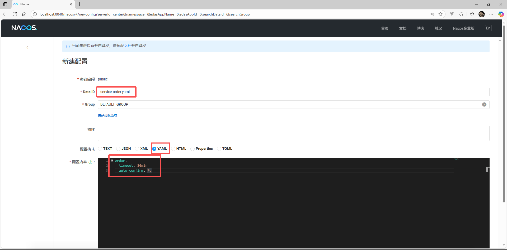

  Data ID 就是这个配置文件的名字，也是你在 SpringBoot 的 yaml 文件中写入想要导入的文件的名字。

  配置格数不多说，就是该文件的格式。

  格式内容就是具体的内容。

+ **Step4 测试导入**

  OrderController 中的 config 方法就是我的测试。
  
  ```java
  package com.sangui.order.controller;
  
  
  import com.sangui.order.bean.Order;
  import com.sangui.order.service.OrderService;
  import jakarta.annotation.Resource;
  import org.springframework.beans.factory.annotation.Value;
  import org.springframework.web.bind.annotation.GetMapping;
  import org.springframework.web.bind.annotation.RequestParam;
  import org.springframework.web.bind.annotation.RestController;
  
  /**
   * @Author: sangui
   * @CreateTime: 2025-09-22
   * @Description:
   * @Version: 1.0
   */
  @RestController
  public class OrderController {
      @Value("${order.timeout}")
      String orderTimeout;
      @Value("${order.auto-confirm}")
      String orderAutoConfirm;
  
      @Resource
      private OrderService orderService;
  
      @GetMapping("/create")
      public Order createOrder(@RequestParam("productId") Long productId,
                               @RequestParam("userId") Long userId) {
          return orderService.createOrder(productId, userId);
      }
  
      @GetMapping("/config")
      public String config() {
          return "orderTimeout=" + orderTimeout + ",orderAutoConfirm=" + orderAutoConfirm;
      }
  }
  
  ```
  
  至此，打开浏览器，输入：http://localhost:8000/config （端口改为 8001 也可），可以看到，返回的数据是这样：
  
  ```
  orderTimeout=30min,orderAutoConfirm=7d
  ```
  
  但是，当我们现在去更新 Nacos 上的数据时，发现浏览器并不能实时更新，它依旧是使用了旧的数据。此时，我们需要在对应的 Controller 类上加入 @RefreshScope 注解，以实时更新，如：
  
  ```java
  package com.sangui.order.controller;
  
  
  import com.sangui.order.bean.Order;
  import com.sangui.order.service.OrderService;
  import jakarta.annotation.Resource;
  import org.springframework.beans.factory.annotation.Value;
  import org.springframework.cloud.context.config.annotation.RefreshScope;
  import org.springframework.web.bind.annotation.GetMapping;
  import org.springframework.web.bind.annotation.RequestParam;
  import org.springframework.web.bind.annotation.RestController;
  
  /**
   * @Author: sangui
   * @CreateTime: 2025-09-22
   * @Description:
   * @Version: 1.0
   */
  @RefreshScope
  @RestController
  public class OrderController {
      @Value("${order.timeout}")
      String orderTimeout;
      @Value("${order.auto-confirm}")
      String orderAutoConfirm;
  
      @Resource
      private OrderService orderService;
  
      @GetMapping("/create")
      public Order createOrder(@RequestParam("productId") Long productId,
                               @RequestParam("userId") Long userId) {
          return orderService.createOrder(productId, userId);
      }
  
      @GetMapping("/config")
      public String config() {
          return "orderTimeout=" + orderTimeout + ",orderAutoConfirm=" + orderAutoConfirm;
      }
  }
  ```

## 2.9. Nacos ——配置中心的动态刷新

上一小节中，我们使用了配置中心，使用的是 @Value 注解，一旦需要导入的变量多了，这个代码就不方便了。使用 @ConfigurationProperties 可以实现无感动态刷新功能。

我们可以定义一个专门存放 Properties 的类：

```java
package com.sangui.order.properties;


import lombok.Data;
import org.springframework.boot.context.properties.ConfigurationProperties;
import org.springframework.stereotype.Component;

/**
 * @Author: sangui
 * @CreateTime: 2025-09-22
 * @Description: 订单的配置文件类
 * @Version: 1.0
 */
// 批量绑定的前缀
@ConfigurationProperties(prefix = "order")
@Component
@Data
public class OrderProperties {

    String timeout;
    // 配置文件中是 auto-confirm 也没关系，会自动驼峰映射成 autoConfirm
    String autoConfirm;
}
```

这里的导入，无需上一章节的 @RefreshScope 注解，即可自动刷新。使用的代码如下：

```java
package com.sangui.order.controller;


import com.sangui.order.bean.Order;
import com.sangui.order.properties.OrderProperties;
import com.sangui.order.service.OrderService;
import jakarta.annotation.Resource;
import org.springframework.beans.factory.annotation.Value;
import org.springframework.cloud.context.config.annotation.RefreshScope;
import org.springframework.web.bind.annotation.GetMapping;
import org.springframework.web.bind.annotation.RequestParam;
import org.springframework.web.bind.annotation.RestController;

/**
 * @Author: sangui
 * @CreateTime: 2025-09-22
 * @Description:
 * @Version: 1.0
 */
// @RefreshScope
@RestController
public class OrderController {
    //    @Value("${order.timeout}")
    //    String orderTimeout;
    //    @Value("${order.auto-confirm}")
    //    String orderAutoConfirm;
    
    @Resource
    OrderProperties orderProperties;

    @Resource
    private OrderService orderService;

    @GetMapping("/create")
    public Order createOrder(@RequestParam("productId") Long productId,
                             @RequestParam("userId") Long userId) {
        return orderService.createOrder(productId, userId);
    }

    @GetMapping("/config")
    public String config() {
        return "orderTimeout=" + orderProperties.getTimeout() + ",orderAutoConfirm=" + orderProperties.getAutoConfirm();
    }
}
```

访问浏览器，是可以看到我们的实时更新的数据的。我们更推荐使用这种方式来进行动态刷新。

## 2.10. Nacos ——配置中心的配置监听

Nacos 可以通过 NaocosConfigManager 监听配置文件值的变化。

加入监听器，这个监听器会在我们程序启动后就一直监听

```java
package com.sangui.order;


import com.alibaba.cloud.nacos.NacosConfigManager;
import com.alibaba.nacos.api.config.ConfigService;
import com.alibaba.nacos.api.config.listener.Listener;
import org.springframework.boot.ApplicationRunner;
import org.springframework.boot.SpringApplication;
import org.springframework.boot.autoconfigure.SpringBootApplication;
import org.springframework.cloud.client.discovery.EnableDiscoveryClient;
import org.springframework.context.annotation.Bean;

import java.util.concurrent.Executor;
import java.util.concurrent.Executors;

/**
 * @Author: sangui
 * @CreateTime: 2025-09-21
 * @Description: 订单微服务的主入口程序
 * @Version: 1.0
 */
@EnableDiscoveryClient
@SpringBootApplication
public class OrderMainApplication {
    /**
     * 我们的整个 web 程序启动后，就会执行这个 applicationRunner 里面的方法。
     * @param nacosConfigManager 注入的对象，用于配置监听
     * @return 具体的方法
     */
    @Bean
    ApplicationRunner applicationRunner(NacosConfigManager nacosConfigManager) {
        // 1.项目启动就去监听配置文件的变化
        return args->{
            // System.out.println("============");

            // 拿到配置服务
            ConfigService configService = nacosConfigManager.getConfigService();
            // 添加监听器，监听 yaml 配置文件，注意，这里也可以监控非 Nacos 的其他配置文件
            configService.addListener("service-order.yaml", "DEFAULT_GROUP", new Listener() {
                @Override
                public Executor getExecutor() {
                    return Executors.newFixedThreadPool(4);
                }

                @Override
                public void receiveConfigInfo(String s) {
                    // 2.发生变化后就拿到变化值
                    System.out.println("service-order.yaml 中改变了，改变内容为：" + s);
                    // 3.发送邮件
                    System.out.println("邮件通知（模拟）......");
                }
            });
        };
    }

    public static void main(String[] args) {
        SpringApplication.run(OrderMainApplication.class, args);
    }
}
```

当我们改变 Nacos 中的配置文件的文件具体内容之后，后端输出了以下内容，证明它监听到了。

```
service-order.yaml 中改变了，改变内容为：order:
  timeout: 3min
  auto-confirm: 3d
邮件通知（模拟）......
```

## 2.11. Nacos ——配置冲突问题

若 Nacos 中的数据集和 application.yaml 中有相同的配置项，哪个会生效？

我们可以直接测试，在 application.yaml 中加入新的配置：

```yaml
order:
  timeout: asd
  auto-confirm: 1jkdas
```

而在 Nacos 配置中心中的数据是这样的：

```yaml
order:
  timeout: 3min
  auto-confirm: 3d
```

打开浏览器，输入：http://localhost:8000/config （端口改为 8001 也可），可以看到，返回的数据是这样：

```
orderTimeout=3min,orderAutoConfirm=3d
```

证明了，当这两个地方都配置了相同的数据项时，会生效 Nacos 配置中心的。

它遵循的是，外部优先。项目启动时，会将所以的配置项合并（包括外部的，内部的），有冲突的数据项，就会合并优先度高的数据，整个整体合并之后，就是我们的配置项，会存入环境变量当中，然后，我们的程序会从环境变量中获取配置值。

此外，还遵循先导入的优先，假如我们的数据是这样的：

```yaml
spring:
  config:
    import:
      - nacos:service-order1.yaml
      - nacos:service-order2.yaml
```

那么若 1 和 2 的配置有冲突，则会选择 1 中的值。

## 2.12. Nacos ——配置中心的数据隔离

需求：假设我们的项目有多套环境，比如 test 、dev 和 prod，即 测试、开发和生产环境，项目中每个微服务的配置信息在每套环境上的值可能不一样，要求每个环境中，配置文件的配置都不一样，项目需要根据不同的环境，切换相对应的配置。

如果要完成以上需求，其中的难点是如何：

- 区分多套环境
- 区分多种微服务
- 区分多种配置
- 按需加载配置

Nacos 的解决方案：

- 用名称空间区分多套环境
- 用 Group 区分多种微服务
- 用 Data-id 区分多种配置
- 使用 SpringBoot 激活对应环境的配置

切换环境时，只需要这样，在 下面的 namespace 处切换，group 写在对应的配置文件后面

```yaml
spring:
  profiles:
    # 代表现在是 test 环境
    active: test
  cloud:
    nacos:
      config:
        # 标记 namespace，和上边的环境绑定，是 test，若上边未指定，则默认为 dev
        namespace: ${spring.profiles.active:dev}
        import-check:
          # 使用这种切换环境的方式时，要把检查配置关闭
          enabled: false

---
 spring:
  config:
    import:
      - nacos:service-order1.yaml?group=order
      - nacos:service-order2.yaml?group=order
    activate:
      # 上边的 import 仅在 test 环境时激活
      on-profile: test
      
---
spring:
  config:
    import:
      - nacos:service-order1.yaml?group=order
      - nacos:service-order2.yaml?group=order
      - nacos:service-order3.yaml?group=order
    activate:
      # 上边的 import 仅在 dev 环境时激活
      on-profile: dev
```

# 3. OpenFeign

OpenFeign，是一种 Declarative REST Client，即声明式 Rest 客户端，与之对应的是编程式 Rest 客户端，比如 RestTemplate。

上一章节学习 Nacos 的过程之中，就接触过 RestTemplate，整个远程调用的流程需要自己手动编码。之前的流程是：

1. 使用 discoveryClient 获取微服务的所有列表
2. 在这些列表中随便挑一个（实现负载均衡）
3. 使用 restTemplate，给挑中的地址发送请求
4. 得到对方响应的数据

现在，我们使用声明式 Rest 客户端，无需再用这些流程，只需要一些简单的注解，就能给远程发送请求。比如：

1. 指定**远程地址**

   @FeignClient

2. 指定**请求方式**

   @GetMapping、@PostMapping、@DeleteMapping ...

3. 指定**携带数据**

   @RequestHeader、@RequestParam、@RequestBody ...

4. 指定**结果返回**

   响应模型

你会发现，这些其实复用了 SpringMVC 的那一套。

## 3.1. openFeign 的远程调用

在没有学习 openFeign 的时候，我们远程调用是这样的：

我们有两个服务，一个订单服务，一个商品服务。订单服务中，准备给商品服务发送请求，请求方式是 Get，地址是： http://service-product/product/{productId} ，商品服务响应给订单服务一个商品类，代码如下：

```java
/**
 * 基于注解的负载均衡远程获取商品信息
 * @param productId 商品 Id
 * @return 商品信息
 */
private Product getProductFromRemoteWithLoadBalanceAnnotation(Long productId) {

    // 确定 url，这里直接写 service-product 这个微服务名就好，restTemplate 会自动负载均衡对应的微服务
    String url = "http://service-product/product/" + productId;
    // 上述 url 为 http://localhost:????/product/{productId}

    // 2、发送远程请求
    return restTemplate.getForObject(url, Product.class);
}
```

现在开始使用 openFeign 发送远程请求。

+ **Step1 添加依赖**

  ```xml
  <!--远程调用-->
  <dependency>
      <groupId>org.springframework.cloud</groupId>
      <artifactId>spring-cloud-starter-openfeign</artifactId>
  </dependency>
  ```

  之前使用 RestTemplate 来远程调用时，也是引入这个依赖。

+ **Step2 开启远程调用功能**

  在订单的主程序的入口类中，加入 @EnableFeignClients 注解，开启 Feign 的远程调用，如：

  ```java
  // 开启 Feign 的远程调用
  @EnableFeignClients
  @EnableDiscoveryClient
  @SpringBootApplication
  public class OrderMainApplication {
  	// ......略
  }
  ```

+ **Step3 添加 Feign 客户端**

  类似之前的 SpringMVC 中的 Controller 的写法，写下我们的 Feign 客户端：

  ```java
  package com.sangui.order.feign;
  
  
  import com.sangui.product.bean.Product;
  import org.springframework.cloud.openfeign.FeignClient;
  import org.springframework.web.bind.annotation.GetMapping;
  import org.springframework.web.bind.annotation.PathVariable;
  
  /**
   * @Author: sangui
   * @CreateTime: 2025-09-24
   * @Description: 调用商品服务的用 Feign 实现的远程调用客户端接口
   * @Version: 1.0
   */
  // 标记这是个 Feign 客户端，里面的 value 的值表示要远程调用的微服务的名字
  @FeignClient("service-product")
  public interface ProductFeignClient {
      // 和 Controller 中的注解一样，只不过这里是主动发送，在 Controller 中是接收
      @GetMapping("/product/{productId}")
      Product getProductById(@PathVariable("productId") Long productId);
  }
  ```

  这个远程调用，也是自动负载均衡的。

+ **Step4 使用远程调用**

  在 Service 类中调用写好远程调用方法即可，如：

  ```java
  package com.sangui.order.service.impl;
  
  
  import com.sangui.order.bean.Order;
  import com.sangui.order.feign.ProductFeignClient;
  import com.sangui.order.service.OrderService;
  import com.sangui.product.bean.Product;
  import jakarta.annotation.Resource;
  import lombok.extern.slf4j.Slf4j;
  import org.springframework.cloud.client.ServiceInstance;
  import org.springframework.cloud.client.discovery.DiscoveryClient;
  import org.springframework.cloud.client.loadbalancer.LoadBalancerClient;
  import org.springframework.stereotype.Service;
  import org.springframework.web.client.RestTemplate;
  
  import java.math.BigDecimal;
  import java.util.Arrays;
  import java.util.List;
  
  /**
   * @Author: sangui
   * @CreateTime: 2025-09-22
   * @Description:
   * @Version: 1.0
   */
  @Slf4j
  @Service
  public class OrderServiceImpl implements OrderService {
      @Resource
      ProductFeignClient productFeignClient;
  
      @Override
      public Order createOrder(Long productId, Long userId) {
          // 之前的调用远程获取商品的方法
          // Product product = getProductFromRemoteWithLoadBalanceAnnotation(productId);
          // 调用 openFeign 远程获取商品的方法
          Product product = productFeignClient.getProductById(productId);
  
          Order order = new Order();
          order.setId(1011L);
          BigDecimal totalAmount = product.getPrice().multiply(new BigDecimal(product.getNumber()));
          order.setTotalAmount(totalAmount);
          order.setUserId(userId);
          order.setNickName("张三");
          order.setAddress("beijing");
          order.setProductList(Arrays.asList(product));
          
          return order;
      }
  }
  ```

至此，打开浏览器，输入：http://localhost:8000/create?productId=1&userId=2 （端口改为 8001 也可），可以看到，后端依旧可以返回如下数据，说明远程调用成功了！

```json
{
  "id": 1011,
  "totalAmount": 65,
  "userId": 2,
  "nickName": "张三",
  "address": "beijing",
  "productList": [
    {
      "id": 1,
      "price": 32.5,
      "productName": "创可贴",
      "number": 2
    }
  ]
}
```

小技巧：要编写 Feign 客户端的时候，直接去对应微服务的 Controller 中，复制对应的方法的方法名和 Mapping 注解，不复制方法体。

## 3.2. openFeign 的第三方 API 的远程调用

我购买试用了墨迹天气的全国天气预报实况的接口 API ，我先在 Postman 中试调用此 API，它的 API 的调用规则为：

1. 请求方式为：POST

2. 请求路径为：https://aliv18.data.moji.com/whapi/json/alicityweather/condition

3. 请求参数为：

   + cityId

     可根据文档查询对应城市的 cityId，查找后，沈阳浑南的 cityId 为 284698

   + token

     固定值，为：50b53ff8dd7d9fa320d3d3ca32cf8ed1

4. 认证信息：Authorization

   在 Header 中添加 Authorization 值，该值是实际就是 API 的密匙。

下图就是我使用 Postman 测试的图片。

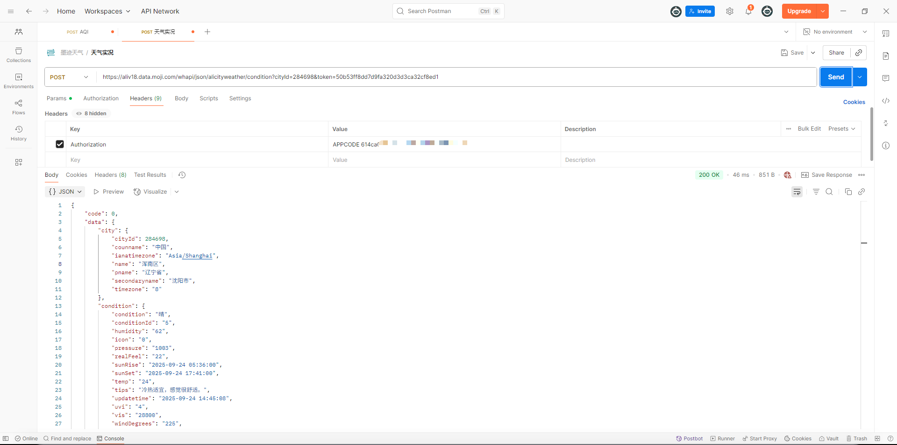

+ **Step1 添加 Feign 客户端**

  还有先前步骤，就是添加 openFeign 的依赖和开启开启远程注解，在上一小节中已说明。

  ```java
  package com.sangui.order.feign;
  
  
  import org.springframework.cloud.openfeign.FeignClient;
  import org.springframework.web.bind.annotation.*;
  
  /**
   * @Author: sangui
   * @CreateTime: 2025-09-24
   * @Description: 远程调用第三方天气 API 的 Feign 客户端接口
   * @Version: 1.0
   */
  // 第三方 API 中，并没有微服务名字，所以 value 值随意写，但是要写请求地址 url
  // 使用 HTTP 协议，因为经测试，目标端点 aliv18.data.moji.com 的 HTTPS 证书缺少 SAN 匹配
  @FeignClient(value = "weather-client", url = "http://aliv18.data.moji.com")
  public interface WeatherFeignClient {
      /**
       *
       * @param auth 在 Header 中添加 Authorization 值，该值是实际就是 API 的密匙
       * @param cityId 可根据文档查询对应城市的 cityId，查找后，沈阳浑南的 cityId 为 284698
       * @param token 固定值，为：50b53ff8dd7d9fa320d3d3ca32cf8ed1
       * @return 该 city 的实况天气的 json 数据
       */
      @PostMapping("/whapi/json/alicityweather/condition")
      String getWeather(@RequestHeader("Authorization") String auth,
                             @RequestParam("cityId") String cityId,
                             @RequestParam("token") String token);
  
  }
  ```

+ **Step2 测试远程调用**

  ```java
  package com.sangui.order;
  
  
  import com.sangui.order.feign.WeatherFeignClient;
  import jakarta.annotation.Resource;
  import org.junit.jupiter.api.Test;
  import org.springframework.boot.test.context.SpringBootTest;
  
  /**
   * @Author: sangui
   * @CreateTime: 2025-09-24
   * @Description: openFeign 的第三方 API 的远程调用测试
   * @Version: 1.0
   */
  @SpringBootTest
  public class WeatherTest {
      @Resource
      WeatherFeignClient weatherFeignClient;
  
      @Test
      void getWeatherTest() {
          String weather = weatherFeignClient.getWeather("APPCODE xxxxxxxxxxxxxxxxxxxxx",
                  "284698", "50b53ff8dd7d9fa320d3d3ca32cf8ed1");
          System.out.println("沈阳浑南的天气实况：" + weather);
      }
  }
  ```

  输出结果为：

  ```
  沈阳浑南的天气实况：{"code":0,"data":{"city":{"cityId":284698,"counname":"中国","ianatimezone":"Asia/Shanghai","name":"浑南区","pname":"辽宁省","secondaryname":"沈阳市","timezone":"8"},"condition":{"condition":"晴","conditionId":"5","humidity":"60","icon":"0","pressure":"1003","realFeel":"22","sunRise":"2025-09-24 05:36:00","sunSet":"2025-09-24 17:41:00","temp":"24","tips":"冷热适宜，感觉很舒适。","updatetime":"2025-09-24 15:15:08","uvi":"3","vis":"30000","windDegrees":"225","windDir":"西南风","windLevel":"4","windSpeed":"6.69"}},"msg":"success","rc":{"c":0,"p":"success"}}
  ```

思考：这里的第三方的 API 的调用中，使用了负载均衡吗？

我们之前使用的自己的程序的远程调用中，肯定使用了负载均衡，它使用的是客户端的负载均衡，就是说，在请求的之前，我们就会选择合适的微服务来使负载均衡，

而我们这里选用第三方的 API 中，我们无法得知这第三方的服务器的具体情况，就无法进行负载均衡，但是，这个第三方在接收到一个请求之后，还是会进行负载均衡的，这就叫做服务端的负载均衡。

也就是说，两者都用了负载均衡，只不过调用我们自己的程序，使用的使客户端负载均衡；调用第三方的 API ，使用的是服务端的负载均衡。

## 3.3. openFeign 的进阶用法

1. **日志**

   开启日志的方法：

   ```yaml
   logging:
     level:
       # 指定 feign 接口所在的包的日志级别为 debug 级别
       com.sangui.order.feign: debug
   ```

   向 Spring 容器中注册 `feign.Logger.Level` 对象：

   ```java
   @Bean
   public Logger.Level feignlogLevel() {
       // 指定 OpenFeign 发请求时，日志级别为 FULL
       return Logger.Level.FULL;
   }
   ```

   这样，openFeign 每发送一个请求，就能看到对应发送的日志。

   将之前天气的例子加入日志，会发现输出的是这样的：

   ```
   2025-09-24T15:58:17.077+08:00 DEBUG 16272 --- [service-order] [           main] c.sangui.order.feign.WeatherFeignClient  : [WeatherFeignClient#getWeather] ---> POST http://aliv18.data.moji.com/whapi/json/alicityweather/condition?cityId=284698&token=50b53ff8dd7d9fa320d3d3ca32cf8ed1 HTTP/1.1
   2025-09-24T15:58:17.077+08:00 DEBUG 16272 --- [service-order] [           main] c.sangui.order.feign.WeatherFeignClient  : [WeatherFeignClient#getWeather] Authorization: APPCODE xxxxxxxxxxxxxxxxxxxxxxxxxxxx
   2025-09-24T15:58:17.077+08:00 DEBUG 16272 --- [service-order] [           main] c.sangui.order.feign.WeatherFeignClient  : [WeatherFeignClient#getWeather] ---> END HTTP (0-byte body)
   2025-09-24T15:58:17.264+08:00 DEBUG 16272 --- [service-order] [           main] c.sangui.order.feign.WeatherFeignClient  : [WeatherFeignClient#getWeather] <--- HTTP/1.1 200 OK (186ms)
   2025-09-24T15:58:17.264+08:00 DEBUG 16272 --- [service-order] [           main] c.sangui.order.feign.WeatherFeignClient  : [WeatherFeignClient#getWeather] connection: keep-alive
   2025-09-24T15:58:17.264+08:00 DEBUG 16272 --- [service-order] [           main] c.sangui.order.feign.WeatherFeignClient  : [WeatherFeignClient#getWeather] content-length: 582
   2025-09-24T15:58:17.264+08:00 DEBUG 16272 --- [service-order] [           main] c.sangui.order.feign.WeatherFeignClient  : [WeatherFeignClient#getWeather] content-type: text/html;charset=UTF-8
   2025-09-24T15:58:17.264+08:00 DEBUG 16272 --- [service-order] [           main] c.sangui.order.feign.WeatherFeignClient  : [WeatherFeignClient#getWeather] date: Wed, 24 Sep 2025 07:58:14 GMT
   2025-09-24T15:58:17.264+08:00 DEBUG 16272 --- [service-order] [           main] c.sangui.order.feign.WeatherFeignClient  : [WeatherFeignClient#getWeather] keep-alive: timeout=25
   2025-09-24T15:58:17.264+08:00 DEBUG 16272 --- [service-order] [           main] c.sangui.order.feign.WeatherFeignClient  : [WeatherFeignClient#getWeather] server: MJWS/Weather4.0
   2025-09-24T15:58:17.264+08:00 DEBUG 16272 --- [service-order] [           main] c.sangui.order.feign.WeatherFeignClient  : [WeatherFeignClient#getWeather] vary: Accept-Encoding
   2025-09-24T15:58:17.264+08:00 DEBUG 16272 --- [service-order] [           main] c.sangui.order.feign.WeatherFeignClient  : [WeatherFeignClient#getWeather] x-ca-request-id: 9B47AD2B-108B-43ED-8129-E044DF0189B5
   2025-09-24T15:58:17.264+08:00 DEBUG 16272 --- [service-order] [           main] c.sangui.order.feign.WeatherFeignClient  : [WeatherFeignClient#getWeather] 
   2025-09-24T15:58:17.265+08:00 DEBUG 16272 --- [service-order] [           main] c.sangui.order.feign.WeatherFeignClient  : [WeatherFeignClient#getWeather] {"code":0,"data":{"city":{"cityId":284698,"counname":"中国","ianatimezone":"Asia/Shanghai","name":"浑南区","pname":"辽宁省","secondaryname":"沈阳市","timezone":"8"},"condition":{"condition":"晴","conditionId":"5","humidity":"59","icon":"0","pressure":"1003","realFeel":"24","sunRise":"2025-09-24 05:36:00","sunSet":"2025-09-24 17:41:00","temp":"24","tips":"冷热适宜，感觉很舒适。","updatetime":"2025-09-24 15:50:08","uvi":"4","vis":"30000","windDegrees":"180","windDir":"南风","windLevel":"2","windSpeed":"3.11"}},"msg":"success","rc":{"c":0,"p":"success"}}
   2025-09-24T15:58:17.265+08:00 DEBUG 16272 --- [service-order] [           main] c.sangui.order.feign.WeatherFeignClient  : [WeatherFeignClient#getWeather] <--- END HTTP (582-byte body)
   沈阳浑南的天气实况：{"code":0,"data":{"city":{"cityId":284698,"counname":"中国","ianatimezone":"Asia/Shanghai","name":"浑南区","pname":"辽宁省","secondaryname":"沈阳市","timezone":"8"},"condition":{"condition":"晴","conditionId":"5","humidity":"59","icon":"0","pressure":"1003","realFeel":"24","sunRise":"2025-09-24 05:36:00","sunSet":"2025-09-24 17:41:00","temp":"24","tips":"冷热适宜，感觉很舒适。","updatetime":"2025-09-24 15:50:08","uvi":"4","vis":"30000","windDegrees":"180","windDir":"南风","windLevel":"2","windSpeed":"3.11"}},"msg":"success","rc":{"c":0,"p":"success"}}
   ```

2. **超时控制**

   发送请求的微服务 A，给微服务 B 发送一个请求，微服务 B 因为若干原因无法响应或连接不上了，微服务 A 就有可能引发服务雪崩的问题，也就是 A 因为 B 的慢，导致了 A 在等 B，或许还有个 C 在等 A，这就导致了因为一个微服务的不可用，整个项目停摆了。为了避免出现这种情况，引入了超时控制机制。就是服务 A 会有一个限时等待，若超过这个时间，便会中断这次调用，返回错误信息或返回默认值（使用 Sentinel）。

   一次请求其实有多个步骤：

   1. A、B 之间建立连接
   2. A 发送请求
   3. B 处理请求
   4. B 返回给 A 响应

   我们的超时，共有两种：

   + **连接超时**（connectTimeout），默认 10 秒。

     连接超时，即步骤 1 的时间超时。

   + **读取超时**（readTimeout），默认 60 秒。

     读取超时，即步骤 2、3、4 的时间的和超时。

   写了一个简易的程序，模拟一下读取超时，即在微服务 B （service-product）中加入模拟超时。

   ```java
   package com.sangui.product.service.impl;
   
   
   import com.sangui.product.bean.Product;
   import com.sangui.product.service.ProductService;
   import org.springframework.stereotype.Service;
   
   import java.math.BigDecimal;
   import java.util.concurrent.TimeUnit;
   
   /**
    * @Author: sangui
    * @CreateTime: 2025-09-22
    * @Description: 商品的 Service 类的实现类
    * @Version: 1.0
    */
   @Service
   public class ProductServiceImpl implements ProductService {
       @Override
       public Product getProductById(Long productId) {
           try {
               // 模拟读取超时，设置 100 秒
               TimeUnit.SECONDS.sleep(100);
           } catch (InterruptedException e) {
               throw new RuntimeException(e);
           }
   
           return new Product(productId,new BigDecimal("32.5"),"创可贴",2);
       }
   }
   ```

   微服务 A （service-order）发送请求之后，浏览器一直在转圈，直到 60 秒之后，后端爆出 500 错误提示，并放回了错误信息。

   如果需要修改默认超时时间，在配置文件中进行如下配置：

   ```yaml
   spring:
     cloud:
       openfeign:
         client:
           config:
             # 默认配置
             default:
               logger-level: full
               connect-timeout: 1000
               read-timeout: 2000
             # 具体 feign 客户端的超时配置
             service-product:
               logger-level: full
               # 连接超时，3 秒
               connect-timeout: 3000
               # 读取超时，5 秒
               read-timeout: 5000
   ```

3. **重试机制**

   远程调用超时失败后，还可以进行多次尝试，如果某次成功则返回 ok；如果多次尝试后依然失败则结束调用，返回错误。

   OpenFeign 底层默认使用 `NEVER_RETRY`，即从不重试策略。

   若我们要开启重试机制，则需向 Spring 容器中添加 `Retryer` 类型的 Bean：

   ```java
   @Bean
   public Retryer retryer() {
       return new Retryer.Default();
   }
   ```

   这里看 `Retryer.Default` 的源代码，这种默认实现如下：

   ```java
   public Default() {
       // 间隔 100 毫秒，最大间隔 1 秒，最大尝试 5 次
       this(100L, TimeUnit.SECONDS.toMillis(1L), 5);
   }
   ```

   此重试规则是：

   - 重试间隔 100ms
   - 最大重试间隔 1s
   - 最多重试 5 次。新一次重试间隔是上一次重试间隔的 1.5 倍，但不能超过最大重试间隔，即上面的 1 s。

   注意是给同一个微服务实例发送重试请求的！（中途不会因为开启了负载均衡而换别的实例）

4. **拦截器**

   openFeign 可以对远程调用请求之前这个节点，和对方响应回来之后的这个节点，都有拦截器可以使用。

   对于发送远程调用请求之前这个节点的拦截器，称之为**请求拦截器**，可以对请求做出修改，比如加入 token 之类的操作。

   对于对方响应回来之后的这个节点的拦截器，称之为**响应拦截器**，可以在接收响应之前，修改这个响应的数据，对响应作出预处理。响应拦截器一般用的不多。

   以请求拦截器为例，自定义的请求拦截器需要实现 `RequestInterceptor` 接口，并重写 `apply()` 方法：

   ```java
   package com.sangui.order.interceptor;
   
   
   import feign.RequestInterceptor;
   import feign.RequestTemplate;
   
   import java.util.UUID;
   
   /**
    * @Author: sangui
    * @CreateTime: 2025-09-24
    * @Description: 请求拦截器，用于增加请求头的 XToken
    * @Version: 1.0
    */
   public class XTokenRequestInterceptor implements RequestInterceptor {
       @Override
       public void apply(RequestTemplate template) {
           System.out.println("XTokenRequestInterceptor execute!");
           template.header("X-Token", UUID.randomUUID().toString());
       }
   }
   ```

   要想要该拦截器生效有两种方法：

   1. 在配置文件中配置对应 Feign 客户端的请求拦截器，此时该拦截器只对指定的 Feign 客户端生效

      ```yaml
      spring:
        cloud:
          openfeign:
            client:
              config:
                # 具体 feign 客户端
                service-product:
                  # 该请求拦截器仅对当前客户端有效
                  request-interceptors:
                    - com.sangui.order.interceptor.XTokenRequestInterceptor
      ```

   2. 将此请求拦截器添加到 Spring 容器中，此时该拦截器对服务内的所有 Feign 客户端生效

      ```java
      @Component
      public class XTokenRequestInterceptor implements RequestInterceptor {
          // 略
      }
      ```

   当我们发送请求后，可以从输出和日志看到，请求已经被拦截加了我们要的内容：

   ```
   XTokenRequestInterceptor execute!
   2025-09-24T17:11:11.518+08:00 DEBUG 8712 --- [service-order] [nio-8000-exec-1] c.sangui.order.feign.ProductFeignClient  : [ProductFeignClient#getProductById] ---> GET http://service-product/product/1 HTTP/1.1
   2025-09-24T17:11:11.518+08:00 DEBUG 8712 --- [service-order] [nio-8000-exec-1] c.sangui.order.feign.ProductFeignClient  : [ProductFeignClient#getProductById] X-Token: 1b99b4b5-9106-41ac-8f39-e36e92b1e003
   2025-09-24T17:11:11.518+08:00 DEBUG 8712 --- [service-order] [nio-8000-exec-1] c.sangui.order.feign.ProductFeignClient  : [ProductFeignClient#getProductById] ---> END HTTP (0-byte body)
   2025-09-24T17:11:11.668+08:00 DEBUG 8712 --- [service-order] [nio-8000-exec-1] c.sangui.order.feign.ProductFeignClient  : [ProductFeignClient#getProductById] <--- HTTP/1.1 200 (149ms)
   2025-09-24T17:11:11.668+08:00 DEBUG 8712 --- [service-order] [nio-8000-exec-1] c.sangui.order.feign.ProductFeignClient  : [ProductFeignClient#getProductById] connection: keep-alive
   2025-09-24T17:11:11.668+08:00 DEBUG 8712 --- [service-order] [nio-8000-exec-1] c.sangui.order.feign.ProductFeignClient  : [ProductFeignClient#getProductById] content-type: application/json
   2025-09-24T17:11:11.668+08:00 DEBUG 8712 --- [service-order] [nio-8000-exec-1] c.sangui.order.feign.ProductFeignClient  : [ProductFeignClient#getProductById] date: Wed, 24 Sep 2025 09:11:11 GMT
   2025-09-24T17:11:11.668+08:00 DEBUG 8712 --- [service-order] [nio-8000-exec-1] c.sangui.order.feign.ProductFeignClient  : [ProductFeignClient#getProductById] keep-alive: timeout=60
   2025-09-24T17:11:11.668+08:00 DEBUG 8712 --- [service-order] [nio-8000-exec-1] c.sangui.order.feign.ProductFeignClient  : [ProductFeignClient#getProductById] transfer-encoding: chunked
   2025-09-24T17:11:11.668+08:00 DEBUG 8712 --- [service-order] [nio-8000-exec-1] c.sangui.order.feign.ProductFeignClient  : [ProductFeignClient#getProductById] 
   2025-09-24T17:11:11.668+08:00 DEBUG 8712 --- [service-order] [nio-8000-exec-1] c.sangui.order.feign.ProductFeignClient  : [ProductFeignClient#getProductById] {"id":1,"price":32.5,"productName":"创可贴","number":2}
   2025-09-24T17:11:11.669+08:00 DEBUG 8712 --- [service-order] [nio-8000-exec-1] c.sangui.order.feign.ProductFeignClient  : [ProductFeignClient#getProductById] <--- END HTTP (58-byte body)
   ```

5. **Fallback**

   Fallback，即兜底返回。它的作用，就是之前在`超时控制` 中提到过，若超时，返回一个默认值，就是兜底返回。注意，此功能需要整合 Sentinel 才能实现。

   > 超时控制：
   >
   > 发送请求的微服务 A，给微服务 B 发送一个请求，微服务 B 因为若干原因无法响应或连接不上了，微服务 A 就有可能引发服务雪崩的问题，也就是 A 因为 B 的慢，导致了 A 在等 B，或许还有个 C 在等 A，这就导致了因为一个微服务的不可用，整个项目停摆了。为了避免出现这种情况，引入了超时控制机制。就是服务 A 会有一个限时等待，若超过这个时间，便会中断这次调用，返回错误信息或**返回默认值（使用 Sentinel）**。

   + **Step1 添加依赖** 

     ```xml
     <!--Sentinel 依赖-->
     <dependency>
         <groupId>com.alibaba.cloud</groupId>
         <artifactId>spring-cloud-starter-alibaba-sentinel</artifactId>
     </dependency>
     ```

   + **Step2 开启配置**

     并在配置文件中开启配置：

     ```yaml
     feign:
       sentinel:
         enabled: true
     ```

   + **Step3 创建 fallback 类**

     这个 fallback  类，其实就是之前写好的 ProductFeignClient 的具体实现类，需要继承它，写好方法体。类似 Service 接口 和 ServiceImpl 类的形式。

     ```java
     package com.sangui.order.feign.fallback;
     
     
     import com.sangui.order.feign.ProductFeignClient;
     import com.sangui.product.bean.Product;
     
     import java.math.BigDecimal;
     
     /**
      * @Author: sangui
      * @CreateTime: 2025-09-24
      * @Description: ProductFeignClient 接口的 fallback
      * @Version: 1.0
      */
     public class ProductFeignClientFallback implements ProductFeignClient {
         @Override
         public Product getProductById(Long productId) {
             System.out.println("Fallback...");
     
             Product product = new Product();
             product.setId(productId);
             product.setPrice(new BigDecimal("0"));
             product.setProductName("未知商品");
             product.setNumber(0);
     
             return product;
         }
     }
     ```

   + **Step4 启用写好的 fallback 类**

     在对于接口的类上，@FeignClient 注解处，加上 fallback = 具体的 fallback  的 class 

     ```java
     package com.sangui.order.feign;
     
     
     import com.sangui.order.feign.fallback.ProductFeignClientFallback;
     import com.sangui.product.bean.Product;
     import org.springframework.cloud.openfeign.FeignClient;
     import org.springframework.web.bind.annotation.GetMapping;
     import org.springframework.web.bind.annotation.PathVariable;
     
     /**
      * @Author: sangui
      * @CreateTime: 2025-09-24
      * @Description: 调用商品服务的用 Feign 实现的远程调用客户端接口
      * @Version: 1.0
      */
     // fallback 里写的就是兜底的数据返回
     @FeignClient(value = "service-product", fallback = ProductFeignClientFallback.class)
     public interface ProductFeignClient {
         @GetMapping("/product/{productId}")
         Product getProductById(@PathVariable("productId") Long productId);
     }
     ```

   此时，当我们启动项目，将 service-product 服务中的代码故意阻塞，访问浏览器，输入：http://localhost:8000/create?productId=1&userId=2 （端口改为 8001 也可），等待许久之后，可以看到，后端返回如下数据：

   ```json
   {
     "id": 1011,
     "totalAmount": 0,
     "userId": 2,
     "nickName": "张三",
     "address": "beijing",
     "productList": [
       {
         "id": 1,
         "price": 0,
         "productName": "未知商品",
         "number": 0
       }
     ]
   }
   ```

# 4. Sentinel

随着微服务的流行，服务和服务之间的稳定性变得越来越重要。Spring Cloud Alibaba Sentinel 以流量为切入点，从流量控制、流量路由、熔断降级、系统自适应过载保护、热点流量防护等多个维度保护服务的稳定性。

Sentinel 是 SpringCloud Alibaba 提供的用于服务保护的框架，服务保护的常见手段就是**限流**和**熔断降级**。

## 4.1. 工作原理

定义规则：

- 主流框架自动适配（Web Servlet、Dubbo、Spring Cloud、gRPC、Spring WebFlux、Reactor），所有 Web 接口均为资源 

- 编程式：SphU API

- 声明式：`@SentinelResource`

定义资源：

- 流量控制（FlowRule）

- 熔断降级（DegradeRule）

- 系统保护（SystemRule）

- 来源访问控制（AuthorityRule）

- 热点参数（ParamFlowRule）

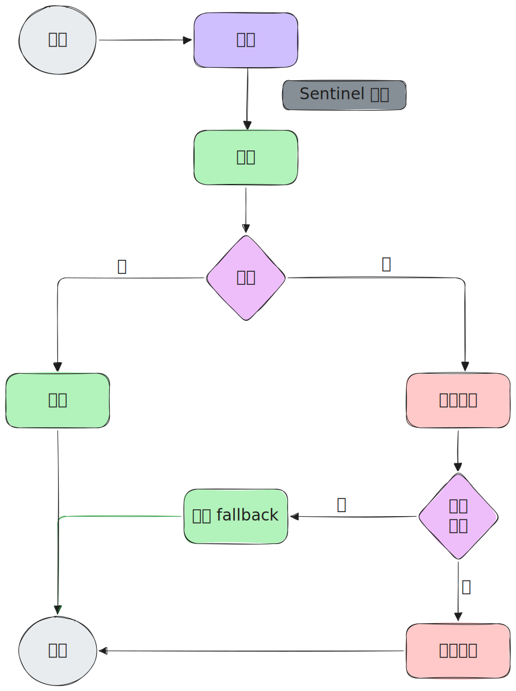

## 4.2. 整合 Sentinel

+ **Step1 启动 Dashboard**

  下载本地的 Sentinel ，下载地址：https://github.com/alibaba/Sentinel/releases 。

  下载得到 `sentinel-dashboard-1.8.8.jar` ，在此目录下 ，输入以下命令，以启动 Dashboard：

  ```cmd
  java -jar sentinel-dashboard-1.8.8.jar
  ```

  启动完成后，浏览器访问 http://localhost:8080/ ，默认用户与密码均为 `sentinel`。

  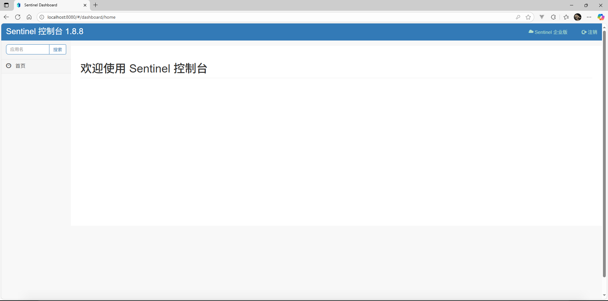

+ **Step2 服务整合 Sentinel**

  引入依赖：

  ```xml
  <dependency>
      <groupId>com.alibaba.cloud</groupId>
      <artifactId>spring-cloud-starter-alibaba-sentinel</artifactId>
  </dependency>
  ```

  在配置文件中添加：

  ```yaml
  spring:
    cloud:
      sentinel:
        transport:
          # 控制台地址
          dashboard: localhost:8080
        # 立即加载服务  
        eager: true
  ```

  配置完成后启动对应服务，再前往 Sentinel Dashboard 查看，能够看到对应服务信息，如下图。

  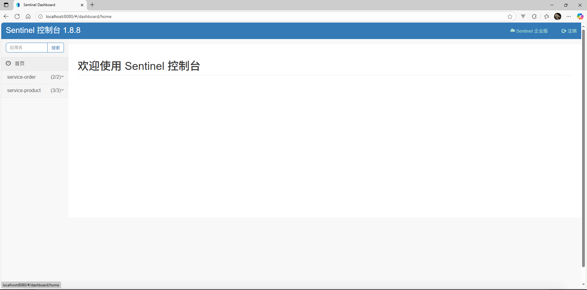

  可以在一个方法上使用 `@SentinelResource` 注解，将其标记为一个「资源」，当方法被调用时，能够在 Dashboard 的「簇点链路」上找到对应的资源，之后在界面上完成对资源的流控、熔断、热点、授权等操作，如：

  ```java
  package com.sangui.order.service.impl;
  
  
  // import......
  
  /**
   * @Author: sangui
   * @CreateTime: 2025-09-22
   * @Description:
   * @Version: 1.0
   */
  @Slf4j
  @Service
  public class OrderServiceImpl implements OrderService {
      // 加入注解，标记为一个资源，取名为：createOrder
      @SentinelResource(value="createOrder")
      @Override
      public Order createOrder(Long productId, Long userId) {
          // ...略
      }
  }
  ```

  之后我们访问：http://localhost:8000/create?productId=1&userId=2 ，以具体使用。正确访问之后，返回 Sentinel 控制台，点进对于微服务的 `簇点链路`，刷新即可看到这个调用链的过程。

  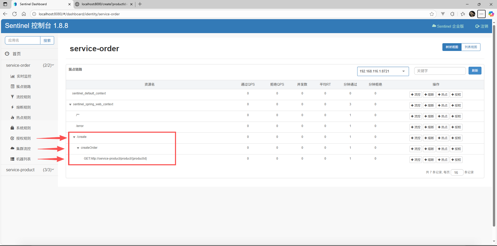

## 4.3. 异常处理

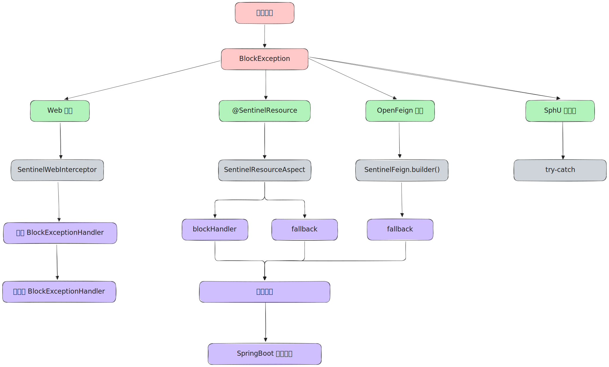

+ **自定义 web 接口的 Handler**

  当 Web 接口作为资源被流控时，默认情况下会在页面显示：

  ```
  Blocked by Sentinel (flow limiting)
  ```

  如果需要自定义异常处理，可以实现 `BlockExceptionHandler` 接口，并将实现类交给 Spring 管理：

  ```java
  package com.sangui.order.exception;
  
  
  import com.alibaba.csp.sentinel.adapter.spring.webmvc_v6x.callback.BlockExceptionHandler;
  import com.alibaba.csp.sentinel.slots.block.BlockException;
  import com.sangui.common.JsonUtils;
  import com.sangui.common.R;
  import jakarta.servlet.http.HttpServletRequest;
  import jakarta.servlet.http.HttpServletResponse;
  import org.springframework.stereotype.Component;
  
  import java.io.PrintWriter;
  
  /**
   * @Author: sangui
   * @CreateTime: 2025-09-27
   * @Description: 我的自定义 web 接口的 Handler
   * @Version: 1.0
   */
  @Component
  public class MyBlockExceptionHandler implements BlockExceptionHandler {
  
      @Override
      public void handle(HttpServletRequest httpServletRequest, HttpServletResponse httpServletResponse, String s, BlockException e) throws Exception {
          httpServletResponse.setContentType("application/json;charset=utf-8");
          PrintWriter writer = httpServletResponse.getWriter();
  
          // 自定义返回信息
          R r = R.fail("此服务：" + s + "，被 Sentinel 限制了，原因：" +  e.getClass());
          // 返回 json 格式的数据
          writer.write(JsonUtils.toJson(r));
          writer.flush();
          writer.close();
      }
  }
  ```

  以 `/create` 接口为例，当其被流控时，页面显示就变成了这样：

  ```json
  {
    "code": 500,
    "msg": "此服务：/create，被 Sentinel 限制了，原因：class com.alibaba.csp.sentinel.slots.block.flow.FlowException",
    "data": null
  }
  ```

+ **@SentinelResource**

  当 `@SentinelResource` 注解标记的资源被流控时，默认返回 500 错误页。

  如果需要自定义异常处理，一般可以增加 `@SentinelResource` 注解的以下任意配置：

  - `blockHandler`
  - `fallback`
  - `defaultFallback`

  以 `blockHandler` 为例：

  ```java
  package com.sangui.order.service.impl;
  
  
  // import......
  
  /**
   * @Author: sangui
   * @CreateTime: 2025-09-22
   * @Description:
   * @Version: 1.0
   */
  @Slf4j
  @Service
  public class OrderServiceImpl implements OrderService {
  
      // 加入 blockHandler，设置该方法的兜底回调的方法名
      @SentinelResource(value="createOrder",blockHandler = "createOrderFallback")
      @Override
      public Order createOrder(Long productId, Long userId) {
          // ...略
      }
      // createOrder 的兜底回调
      public Order createOrderFallback(Long productId, Long userId, BlockException e) {
          Order order = new Order();
          order.setId(-1L);
          order.setTotalAmount(new BigDecimal("0.00"));
          order.setUserId(userId);
          order.setNickName("未知用户");
          order.setAddress("未知地址，" + e.getClass());
          return order;
      }
  }
  ```

+ Feign 接口

  在上一个章节 Nacos 中讲过。就是写一个 fallback  类，其实就是之前写好的 ProductFeignClient 的具体实现类，需要继承它，写好方法体。类似 Service 接口 和 ServiceImpl 类的形式。

## 4.4. 流控规则

流控，即流量控制（FlowRule），用于限制多余请求，从而保护系统资源不被耗尽。

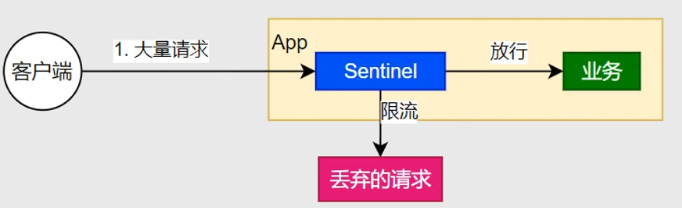

1. **阈值类型**

   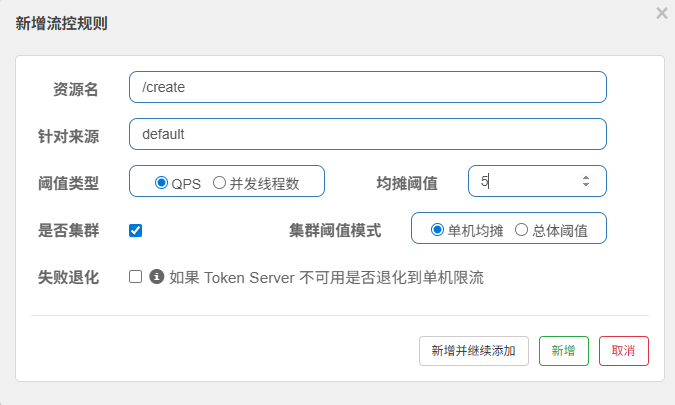

   Sentinel 的流控阈值规则有两种：

   + QPS：Queries Per Second，用于限制资源每秒的请求次数，防止突发流量，应用于高频短时接口（如 API 网关）。当每秒的请求数超过设定的阈值时，就会触发流控。比如上图设置的 QPS = 5，就表示每秒最多允许 5 个请求。

   + 并发线程数：用于限制同时处理该资源的线程数（即并发数），保护系统资源（线程池），应用于耗时操作（如数据库查询）。当处理该资源的线程数超过阈值时，就会触发流控。比如设置并发线程数为 5，表示最多允许 5 个线程同时处理该资源。

   当勾选「是否集群」时，有两种集群阈值模式可供选择：

   + 单机均摊：将设置的「均摊阈值」均摊到每个节点。以上图为例，假设集群有 3 个节点，那么每个节点的阈值都是 5；

   + 总体阈值：整个集群共享设置的「均摊阈值」。假设集群有 3 个节点，这 3 个节点的的总阈值只有 5，比如按 `2个、2个、1个` 的形式将阈值均摊到每个节点。

2. **流控模式**

   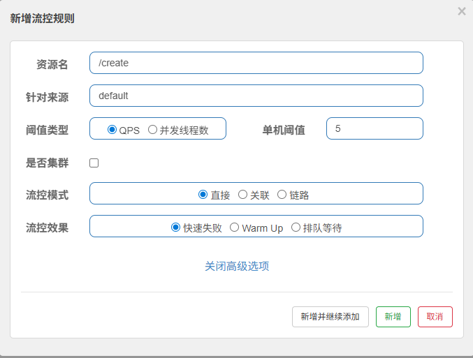

   配置流控规则时，可以点击下方的「高级选项」，在这里可以配置「流控模式」，共有三种可选项：

   1. 直接：默认选项。
   2. 关联：关联资源超阈值时，限流当前资源。
   3. 链路：仅对于某一路径下的资源访问生效。使用时需要在配置文件中设置 `spring.cloud.sentinel.web-context-unify=false`。

   调用关系包括调用方、被调用方；一个方法又可能会调用其他方法，形成一个调用链路的层次关系；有了调用链路的统计信息，可以衍生出多种流量控制手段。

   这三个里的`直接`很好理解。详细说一下另外两个，即**关联** 和 **链路**。

   + 说一下里面的`链路`。实际举例其中的链路。有一个 createOrder 资源，通过普通的 /create 进入（不限流），也可以是通过秒杀 /seckill 进入（限流）。

     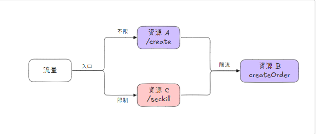

     ```java
     package com.sangui.order.controller;
     
     
     // import......
     
     @RestController
     public class OrderController {
         // .....略
     
         @GetMapping("/create")
         public Order createOrder(@RequestParam("productId") Long productId,
                                  @RequestParam("userId") Long userId) {
             return orderService.createOrder(productId, userId);
         }
     
         // 秒杀订单
         @GetMapping("/seckill")
         public Order seckill(@RequestParam("productId") Long productId,
                                  @RequestParam("userId") Long userId) {
             Order order = orderService.createOrder(productId, userId);
             order.setId(Long.MAX_VALUE);
             System.out.println("我是秒杀");
             return order;
         }
     }
     ```

     看代码，他们的实际调用都一样，但是秒杀的功能却想设置成限流的，根据他们走的不同链路，设置限流方法。

     在注解中先开启：

     ```yaml
     spring:
       cloud:
         sentinel:
           # false 代表不要不分割请求链路，即分割请求链路
           web-context-unify: false
     ```

     打开服务后，发别访问两个地址：http://localhost:8000/create?productId=1&userId=2 和 http://localhost:8000/seckill?productId=1&userId=2 之后，看我们 Sentinel 的控制台簇点链路，如下图所示，可以分别看到两个的具体情况。

     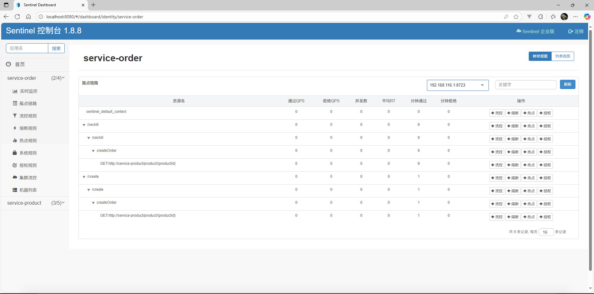

     随便选择其中的资源名叫做 createOrder 的资源，为其限流，限流模式选为链路，入口资源为 /seckill。现在，测试刚才两个链接之后，发现 seckill 就限流了，create 就没有限流。

   + **关联**

     说一下里面的`关联`。实际举例其中的关联。有一个 **读** 和一个 **写** 的操作，因为在实际操作中，写一般耗时较长，而读较快，并且两者又是强关联的，先读才能写。于是当写的东西特别多的时候，就给读限流，但是，当写的东西不多的时候，就不给读限流。

     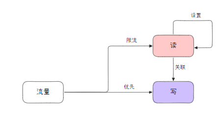

     ```java
     package com.sangui.order.controller;
     
     
     // import......
     
     @RestController
     public class OrderController {
         // .....略
     
        // 写数据到数据库
         @GetMapping("/writeDb")
         public String writeDb() {
             return "writeDb success";
         }
     
         // 读数据
         @GetMapping("/readDb")
         public String read() {
             return "readDb success";
         }
     }
     ```

     这时，运行程序，在 Sentinel 控制台中为 /readDb 新增流控规则，模式设置为关联，关联资源设置为 /writeDb。

     这里，看似是直接对 /readDb 限流，但是，当我们大量请求 /readDb 时，并不会限流。此时，当我们一直频繁访问 /writeDb，再马上访问 /readDb 时，/readDb 页面就会限流了。

3. **流控效果**

   打开流控规则中的高级配置后，还可以配置「流控效果」，同样有三种选项：

   + **快速失败**：默认选项。注意，只有该选项支持「流控模式」（直接、关联、链路）的设置。

   + **Warm Up**：需要设置 period（单位：秒），初始 QPS 较低，随后在 period 时间段内逐步提升至设定的 QPS 。例如设定 QPS 值为 5 、period 时间 3 秒，初始时 QPS 较低，3 秒内逐步升至 5 QPS。注意，若选择了此模式，「流控模式」中只能选择「直接」。

   + **排队等待**：需要设置 timeout（单位：秒），每秒只处理设置的 QPS 数量的请求，多余的请求会等待，当存在请求等待的实际超过设定的 timeout 值时，请求会被拒绝。注意，若选择了此模式，「流控模式」中只能选择「直接」。

   附加，如何测试一个请求的压力测试？

   使用 postman 工具。先用正常的方式创建要压力测试的请求，再如下图所示：

   + 点击 Runner
   + 将需要压力测试的 api 拖入
   + 输入要执行的次数
   + 输入间隔时间
   + 启动

   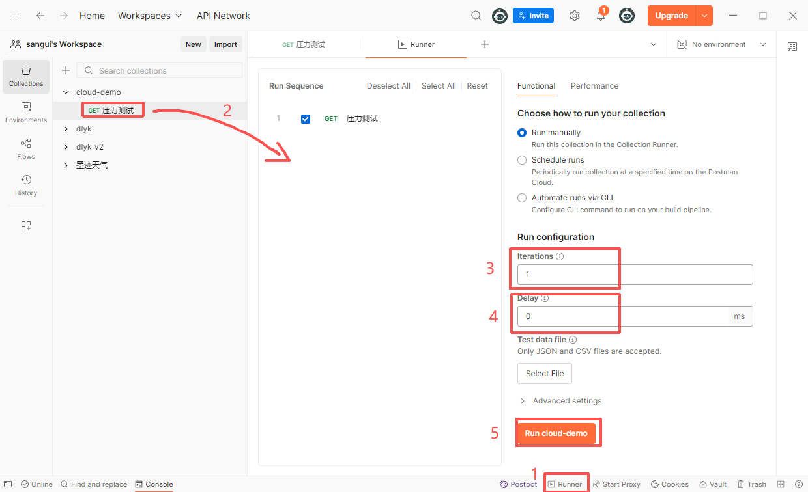

## 4.5. 熔断规则

熔断规则，即 DegradeRule。

使用熔断规则可以配置熔断降级，用于：

- 切断不稳定调用
- 快速返回不积压
- 避免雪崩效应

**最佳实践：** 熔断降级作为保护自身的手段，通常在客户端（调用端）进行配置。

熔断降级里的核心组件是「断路器」，其工作原理如下：

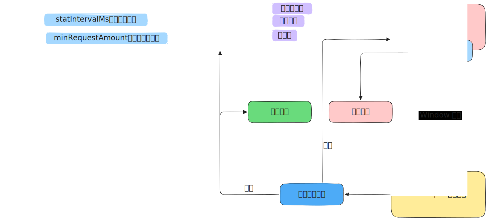

Sentinel 提供了三种熔断策略：

+ 慢调用比例

+ 异常比例

+ 异常数

下面就来详细展开一下。

1. **慢调用比例**

   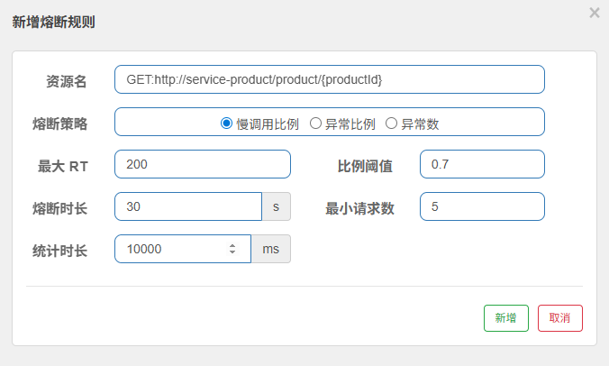

   在 10000ms（图中的统计时长） 内，若请求数量大于等于 5 次，且有 70%（0.7 的比例阈值）的请求的最大响应时间超过 200ms（图中的最大 RT），则进行 30s 的熔断。熔断 30s 之后进入半开状态，再进行一个探测，若可以访问，则继续正常流程，若不能访问，则再熔断30s，重复此流程。


2. **异常比例**

   在远程调用的目标接口里添加 `int i = 1 / 0;` 模拟远程调用异常。

   此时尚未配置任何熔断规则，然后远程调用存在异常的接口，此时会触发使用 OpenFeign 配置的兜底回调。

   换句话说，没有配置任何熔断规则可以触发兜底回调，而配置熔断规则也是为了触发兜底回调，那岂不是配不配置熔断规则都可以？

   当 A 服务向 B 服务发送请求时，远程调用的 B 服务接口中存在异常，此时触发兜底回调。

   在这个过程，由 A 服务发送的请求依旧会打到 B 服务上。

   而配置熔断规则后，A 服务发送的请求快速失败，立即出发兜底回调，不会再把请求打到 B 服务上。

   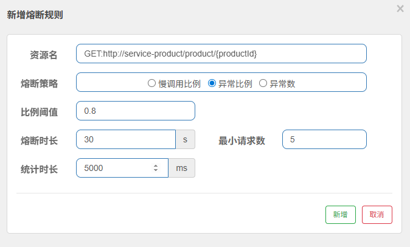

   在 5000ms（图中的统计时长） 内，若请求数量大于等于 5 次，且有 80%（0.8 的比例阈值）的请求产生了异常，则进行 30s 的熔断。熔断 30s 之后进入半开状态，再进行一个探测，若可以访问，则继续正常流程，若不能访问，则再熔断30s，重复此流程。

3. **异常数**

   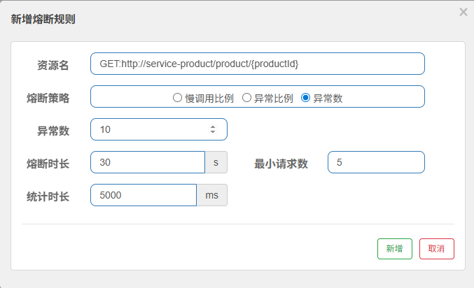

   「异常数」的熔断策略与「异常比例」很类似，只不过「异常数」是直接统计异常个数，就算统计时长内产生了一百万个请求，但只要有 10 个请求出现了异常，也会触发熔断。

## 4.6. 热点规则

所谓热点，即经常访问的数据。很多时候希望统计某个热点数据中访问频次最高的 Top K 数据，并对其访问进行限制。比如：

- 商品 ID 为参数，统计一段时间内最常购买的商品 ID 并进行限制
- 用户 ID 为参数，针对一段时间内频繁访问的用户 ID 进行限制

热点参数限流会统计传入参数中的热点参数，并根据配置的限流阈值与模式，对包含热点参数的资源调用进行限流。

**热点参数限流可以看做是一种特殊的流量控制，仅对包含热点参数的资源调用生效。** 


现有如下需求：

- 每个用户秒杀 QPS 不得超过 1（秒杀下单时，userId 级别）
- 6 号用户是 vvip，不限制 QPS（例外情况）
- 666 号商品是下架商品，不允许访问

先写 Controller ，设定正常的 seckill 方法，写上 @SentinelResource 注解，并配上它的兜底回调，程序如下：

```java
package com.sangui.order.controller;


// import......

@RestController
public class OrderController {
    // .....略

    // 秒杀订单
    @GetMapping("/seckill")
    // 设置 SentinelResource ，名字需设计的和上面的 /seckill 不一样
    @SentinelResource(value = "seckill-order",fallback = "seckillFallback")
    public Order seckill(@RequestParam("productId") Long productId,
                             @RequestParam("userId") Long userId) {
        Order order = orderService.createOrder(productId, userId);
        order.setId(Long.MAX_VALUE);
        return order;
    }


    // 秒杀订单的兜底回调
    @GetMapping("/seckill")
    public Order seckillFallback(@RequestParam("productId") Long productId,
                                 @RequestParam("userId") Long userId, BlockException e) {
        Order order = new Order();
        order.setId(10086L);
        order.setAddress(e.getClass().getName());
        System.out.println("我是 seckill 的兜底回调");
        return order;
    }
}
```

启动后，浏览：http://localhost:8000/seckill?productId=1&userId=2 。查看 Sentinel 控制台，为 seckill-order 创建热点规则

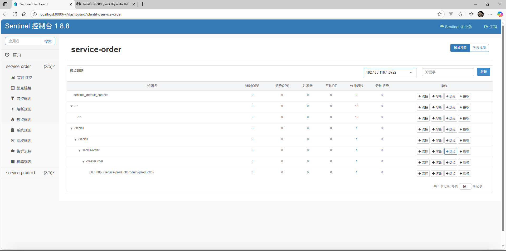

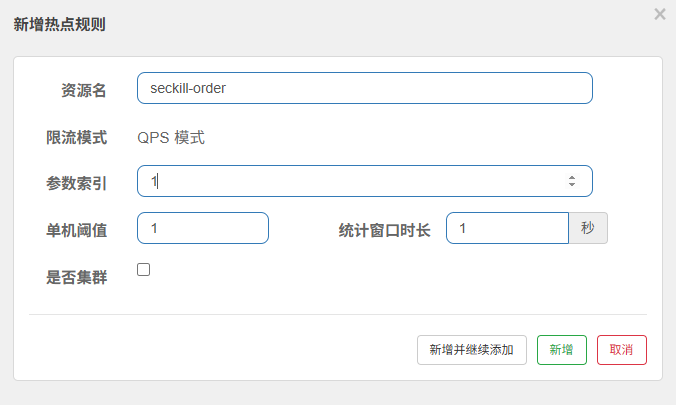

为第 1 个参数（即图中参数索引的值，值最小是 0），设定阈值为 1 （即图中的单机阈值的值）。即在我们的程序（Controller）中，方法对应的第 1 个参数就是`userId` ，代表的是每 1 秒（图中统计窗口时长）每个 userId 只能有一个（图中单机阈值）请求 。（这里就完成了需求1：每个用户秒杀 QPS 不得超过 1（秒杀下单时，userId 级别））

再次修改热点规则，增加高级选项。

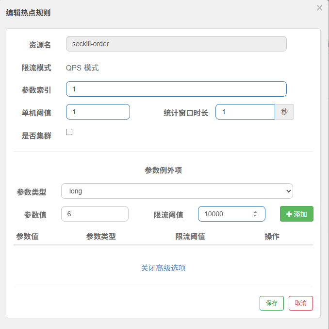

如图，选择参数类型是long，因为我们的第 1 个参数是 userId，类型是 long，设定参数值为6，限流阈值设定一个很高的值（这里就完成了需求2：6 号用户是 vvip，不限制 QPS（例外情况））。

现在还有最后一个需求「666 号商品是下架商品，不允许访问」，这其实相当于：对 666 号商品进行流控（限流阈值为 0，不允许访问），对其他商品不进行流控（或阈值非常大）。

我们还是在 seckill-order 上，新建一个热点规则，如图：

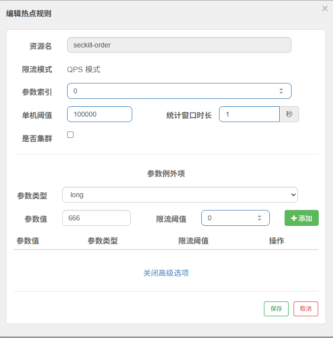

单机阈值设置的很高，因为第 0 个参数（即商品）我们不限流，参数额外项中，设置 long（商品id 的数据类型），参数值666（商品id 为666的商品）,设置流量为 0（这里就完成了需求3：666 号商品是下架商品，不允许访问）。

浏览：[localhost:8000/seckill?productId=666&userId=2](http://localhost:8000/seckill?productId=666&userId=2)  时，即会报出异常。userId=6时也会异常。

# 5. Gateway

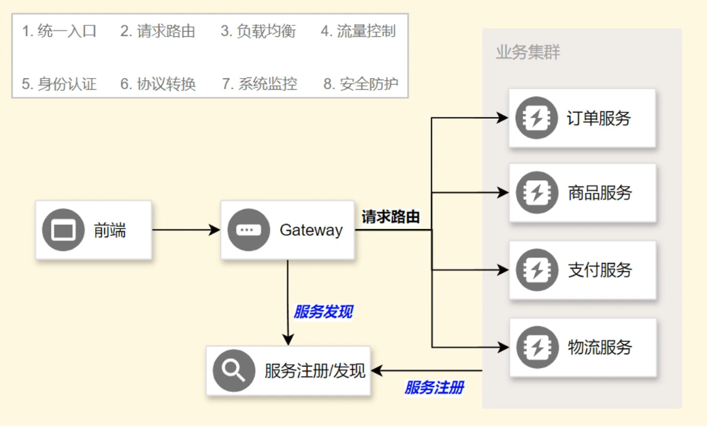

假如我们的业务中有：订单、商品、支付、物流等服务，且这些实例不止一个，所以前端应用可以会要记住非常多的微服务地址，所以引入了 Gateway ，即网关，它就是所以业务集群的入口，以后前端就不需要记住每一个微服务的地址了，只需要记住网关一个的地址就好，前端发送请求到网关，由网关来判断该请求该转给哪个微服务。而网关如何实现把请求传给正确的微服务，就还是依赖于我们之前就学过的`服务注册/发现`的流程。

## 5.1. 路由

需求：

1. 客户端发送 `/api/order/**` 转到 `service-order`
2. 客户端发送 `/api/product/**` 转到 `service-product`
3. 以上转发有负载均衡效果在

下面，就根据这个需求来创建我们的路由。

+ **Step1 新建 gateway 模块**

  在 service 和 model 的同级目录下，新建一个新的模块，叫做 gateway

+ **Step2 添加依赖**

  在新模块下中添加依赖：

  ```xml
  <!--网关的依赖-->
  <dependency>
      <groupId>org.springframework.cloud</groupId>
      <artifactId>spring-cloud-starter-gateway</artifactId>
  </dependency>
  <!--Nacos 注册中心也要引入-->
  <dependency>
      <groupId>com.alibaba.cloud</groupId>
      <artifactId>spring-cloud-starter-alibaba-nacos-discovery</artifactId>
  </dependency>
  <!--负载均衡也要引入-->
  <dependency>
      <groupId>org.springframework.cloud</groupId>
      <artifactId>spring-cloud-starter-loadbalancer</artifactId>
  </dependency>
  ```

+ **Step3 编写主入口程序**

  ```java
  package com.sangui.gateway;
  
  
  import org.springframework.boot.SpringApplication;
  import org.springframework.boot.autoconfigure.SpringBootApplication;
  import org.springframework.cloud.client.discovery.EnableDiscoveryClient;
  
  /**
   * @Author: sangui
   * @CreateTime: 2025-09-28
   * @Description: gateway 的主入口程序
   * @Version: 1.0
   */
  // 加上注解开启发现
  @EnableDiscoveryClient
  @SpringBootApplication
  public class GatewayMainApplication {
      public static void main(String[] args) {
          SpringApplication.run(GatewayMainApplication.class, args);
      }
  }
  ```

+ **Step4 编写配置文件**

  ```yaml
  spring:
    application:
      name: gateway
    cloud:
      nacos:
        server-addr: 127.0.0.1:8848
  server:
    port: 80
  ```

  至此，一个网关就创建完成了，并且可以在 Nacos 配置中心中发现。

+ **Step5 增加路由规则**

  在配置文件中，添加如下规则：

  ```yaml
  spring: 
    cloud: 
  	gateway:
        routes:
            # id 全局唯一
          - id: order-route
            # 指定服务名称，lb 是 loadBalance 的缩写，代表负载均衡
            uri: lb://service-order
            # 指定断言规则，即路由匹配规则。
            predicates:
              - Path=/api/order/**
              # 可添加更多路径规则...
              # - Path=......
            # order 代表顺序，数字越小，优先级越高
            order: 1
  
          # 下一个路由规则
          - id: product-route
            uri: lb://service-product
            predicates:
              - Path=/api/product/**
            order: 2
            
          # 因为路径匹配，这里优先级不高，会先匹配其他的，其他的没匹配上，就会匹这个
          - id: bing-route
            uri: https://cn.bing.com
            predicates:
              - Path=/**
            order: 999
  ```

  当然，这些东西写在 application.yaml 里可能会使配置文件比较臃肿，可以为此新建一个 application-route.yaml 文件，在原配置文件中加入如下内容，即可导入配置：

  ```yaml
  spring:
    profiles:
    	# 自动去找同目录下的 application-route.yaml 文件
      include: route
  ```

+ **Step6 **

  此时，访问：http://localhost:80/api/order/xxx ，还不行，因为还需要修改之前程序的 url，因为网关会直接把 /api/order/xxx 发给对应 order 实例，但实际上，我们 order 的路径是：/xxx，并没有前缀。

  ```java
  package com.sangui.order.controller;
  
  
  // import...
  
  // 加入前缀网址
  @RequestMapping("/api/order")
  @RestController
  public class OrderController {
  	@GetMapping("/writeDb")
      public String writeDb() {
          // ......
      }
  }
  ```

  ```java
  package com.sangui.order.feign;
  
  
  // import...
  
  // 新版本中不允许这样，只能在下面一个一个添加
  //@RequestMapping("/api/product")
  @FeignClient(value = "service-product", fallback = ProductFeignClientFallback.class)
  public interface ProductFeignClient {
      @GetMapping("/api/product/product/{productId}")
      Product getProductById(@PathVariable("productId") Long productId);
  }
  
  ```

  ```java
  package com.sangui.product.controller;
  
  
  // import...
  
  // 加入前缀网址
  @RequestMapping("/api/product")
  @RestController
  public class ProductController {
  	@GetMapping("/product/{id}")
      public Product getProduct(@PathVariable("id") Long productId){
          // ......
      }
  }
  ```

  现在，输入：http://localhost:80/api/order/create?userId=1&productId=2，就可以正确路由并访问了，且这个请求是负载均衡的。

## 5.2. 断言

断言的两种书写方式：

```yaml
spring:
  cloud:
    gateway:
      routes:
        - id: order-route
          uri: lb://service-order
          # 写法一：Fully Expanded Arguments
          predicates:
            - name: Path
              args:
                patterns: /api/order/**
                matchTrailingSlash: true
        - id: product-route
          uri: lb://service-product
          # 写法二：Shortcut Configuration
          # 这种写法就是之前我们的写法
          predicates:
            - Path=/api/product/**
```

在 Spring Cloud Gateway 的实现中，断言的实现都是 `RoutePredicateFactory` 接口的实现。

因此除了直接查看官方文档外确定有哪些断言形式外，还可以通过查看 `RoutePredicateFactory` 的实现：

- `HeaderRoutePredicateFactory`
- `PathRoutePredicateFactory`
- `ReadBodyRoutePredicateFactory`
- `BeforeRoutePredicateFactory`
- ...

断言的名称可以通过去掉实现类名后的 `RoutePredicateFactory` 来确定，比如 `HeaderRoutePredicateFactory` 对应名为 `Header` 的断言。（里面的 Path 就是最常用的）

|         名称         |  参数（个数/类型）  |                             作用                             |
| :------------------: | :-----------------: | :----------------------------------------------------------: |
|        After         |     1/datetime      |                        在指定时间之后                        |
|        Before        |     1/datetime      |                        在指定时间之前                        |
|       Between        |     2/datetime      |                       在指定时间区间内                       |
|        Cookie        |   2/string,regexp   |                包含 cookie 名且必须匹配指定值                |
|        Header        |   2/string,regexp   |                  包含请求头且必须匹配指定值                  |
|         Host         |      N/string       |                  请求 host 必须是指定枚举值                  |
|        Method        |      N/string       |                   请求方式必须是指定枚举值                   |
|         Path         | 2/List<String>,bool |             请求路径满足规则，是否匹配最后的 `/`             |
|        Query         |   2/string,regexp   |                       包含指定请求参数                       |
|      RemoteAddr      |   1/List<String>    |               请求来源于指定网络域（CIDR写法）               |
|        Weight        |    2/string,int     |                      按指定权重负载均衡                      |
| XForwardedRemoteAddr |   1/List<String>    | 从 `X-Forwarded-For` 请求头中解析请求来源，并判断是否来源于指定网络域 |

以 `Query` 为例：

```yaml
spring:
  cloud:
    gateway:
      routes:
        - id: bing-route
          uri: https://cn.bing.com
          predicates:
            - name: Path
              args:
                patterns: /search
            - name: Query
              args:
                param: q
                regexp: haha
```

这表示：访问网关的 `/search` 地址，并且使用了名为 `q` 的请求参数，且值为 `haha`，才会将请求转到 `https://cn.bing.com`。


尽管 Gateway 内置了许多断言规则，但依旧难以满足千变万化的需求。

在上述规则的基础上，再指定一个名为 `Vip` 的断言规则，要求存在名为 `user` 的请求参数，并且值为 `sangui` 时才将请求跳转到 `https://cn.bing.com`：

```yaml
spring:
  cloud:
    gateway:
      routes:
        - id: bing-route
          uri: https://cn.bing.com
          predicates:
            - name: Path
              args:
                patterns: /search
            - name: Query
              args:
                param: q
                regexp: haha
            - Vip=user,sangui
```

自定义 `AbstractRoutePredicateFactory` 实现类 `VipRoutePredicateFactory`：

```java
package com.sangui.gateway.predicate;


import jakarta.validation.constraints.NotEmpty;
import lombok.Getter;
import lombok.Setter;
import org.springframework.cloud.gateway.handler.predicate.AbstractRoutePredicateFactory;
import org.springframework.cloud.gateway.handler.predicate.GatewayPredicate;
import org.springframework.http.server.reactive.ServerHttpRequest;
import org.springframework.stereotype.Component;
import org.springframework.util.StringUtils;
import org.springframework.validation.annotation.Validated;
import org.springframework.web.server.ServerWebExchange;

import java.util.List;
import java.util.function.Predicate;

/**
 * @Author: sangui
 * @CreateTime: 2025-09-28
 * @Description: Vip 断言工厂
 * @Version: 1.0
 */
@Component
// 这里的类名不能瞎写，必须是在 yaml 中写的名字 + RoutePredicateFactory
public class VipRoutePredicateFactory extends AbstractRoutePredicateFactory<VipRoutePredicateFactory.Config> {


    public VipRoutePredicateFactory() {
        super(Config.class);
    }

    @Override
    public List<String> shortcutFieldOrder() {
        return List.of("param", "value");
    }

    @Override
    public Predicate<ServerWebExchange> apply(Config config) {
        return (GatewayPredicate) serverWebExchange -> {
            // localhost/search?q=haha&user=sangui
            ServerHttpRequest request = serverWebExchange.getRequest();
            String first = request.getQueryParams().getFirst(config.param);
            return StringUtils.hasText(first) && first.equals(config.value);
        };
    }

    @Validated
    @Getter
    @Setter
    public static class Config {
        @NotEmpty
        private String param;
        @NotEmpty
        private String value;
    }
}
```

然后访问 http://localhost/search?q=haha&user=sangui  时，会跳转到 Bing 搜索 `haha`。

## 5.3. 过滤器

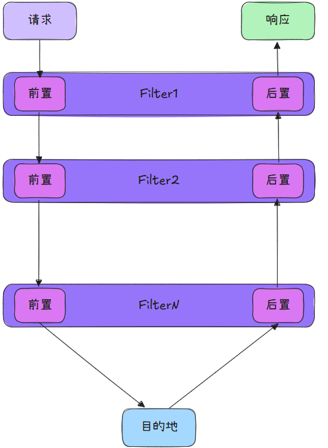

先前在网关中配置了将 `/api/order/` 开头的请求转到 `service-order` 服务，并要求在 `service-order` 服务中也存在 `/api/order/` 开头的请求路径，比如 `/api/order/readDb`。如果该服务中原先并不存在 `/api/order/` 开头的请求，比如只有 `/readDb`，那么在以 `/api/order/readDb` 进行访问就会出现 404 错误。

为了解决这个问题，之前是在 `service-order` 服务对应的 Controller 上添加 `@RequestMapping("/api/order")` 注解，但这并不是最佳方案，如果能直接在网关层面解决这个问题就好了，就像把 `/api/order/readDb` 重写为 `/readDb`。

```yaml
spring:
  cloud:
    gateway:
      routes:
        - id: order-route
          uri: lb://service-order
          predicates:
            - Path=/api/order/**
          # 加上过滤器
          filters:
            # 类似把 /api/order/a/bc 重写为 /a/bc，移除路径前的 /api/order/
            - RewritePath=/api/order/?(?<segment>.*), /$\{segment}

        - id: product-route
          uri: lb://service-product
          predicates:
            - Path=/api/product/**
          # 也加上过滤器
          filters:
            - RewritePath=/api/product/?(?<segment>.*), /$\{segment}
```

现在，访问：http://localhost/api/order/writeDb ，就可以了。

还可以加入其他的 filter，比如：

```yaml
filters:
  - RewritePath=/api/order/?(?<segment>.*), /$\{segment}
  # 添加新的响应头，添加的 key 是 X-Response-sangui，value 是 blog
  - AddResponseHeader=sangui, blog
```

根据浏览器的开发者模式，可以看到，对应的请求已经加上了响应头。

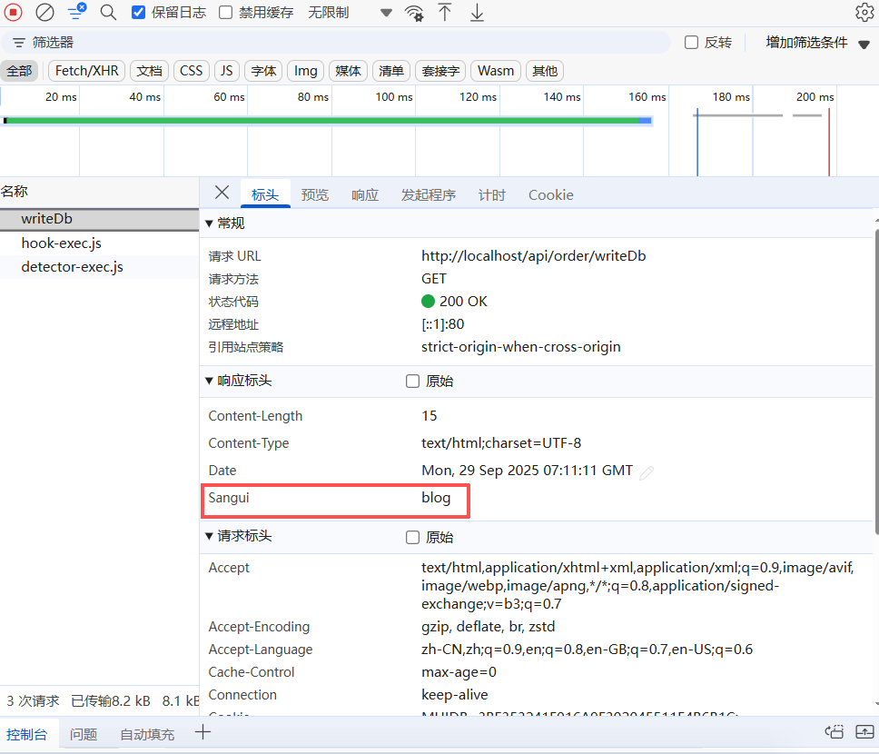

这就是过滤器，可以对请求和响应做出指定的过滤逻辑。

+ 默认过滤器

  所谓默认的过滤器，就是不再是要像之前一样了，匹配一个路径之后，就写一个对应路径的过滤器。默认过滤器是过滤所以的请求和响应。

  ```yaml
  spring:
    cloud:
      gateway:
        default-filters:
          # 为所有路由添加响应头过滤器
          - AddResponseHeader=sangui, blog
        routes:
          # ...
  ```

+ 全局过滤器

  除了默认过滤器，全局过滤器也能为所有路由添加一个过滤器，全局过滤器的配置无需修改配置文件。

  要实现全局过滤器，就得实现 `GlobalFilter` 接口，并将实现类交由 Spring 管理。

  还可以实现 `Ordered` 接口，调整多个全局过滤器的执行顺序。

  ```java
  package com.sangui.filter;
  
  
  import lombok.extern.slf4j.Slf4j;
  import org.springframework.cloud.gateway.filter.GatewayFilterChain;
  import org.springframework.cloud.gateway.filter.GlobalFilter;
  import org.springframework.core.Ordered;
  import org.springframework.http.server.reactive.ServerHttpRequest;
  import org.springframework.stereotype.Component;
  import org.springframework.web.server.ServerWebExchange;
  import reactor.core.publisher.Mono;
  
  /**
   * @Author: sangui
   * @CreateTime: 2025-09-29
   * @Description: 获取每次请求的响应时间的全局过滤器，通过 请求后的时间 减去 请求开始的时间 获取
   * @Version: 1.0
   */
  @Slf4j
  @Component
  // 实现 GlobalFilter 以实现全局过滤，再可选实现 ordered 调整多个全局过滤器的执行顺序
  public class RtGlobalFilter implements GlobalFilter, Ordered {
      @Override
      public Mono<Void> filter(ServerWebExchange exchange, GatewayFilterChain chain) {
          ServerHttpRequest request = exchange.getRequest();
          String uri = request.getURI().toString();
          long start = System.currentTimeMillis();
          log.info("请求 [{}] 开始，时间：{}", uri, start);
          return chain.filter(exchange)
                  .doFinally(res -> {
                      long end = System.currentTimeMillis();
                      log.info("请求 [{}] 结束，时间：{}，耗时：{}ms", uri, start, end - start);
                  });
      }
  
      @Override
      public int getOrder() {
          // 决定过滤器的顺序
          return 0;
      }
  }
  ```

+ 自定义过滤器工厂

  尽管 Gateway 内置了许多过滤器，但仍有无法满足需求的情况，此时就需要自定义过滤器工厂。

  与自定义断言类似，自定义过滤器工厂的类名也有限制，要求以 `GatewayFilterFactory` 结尾，而配置文件中配置的名称就是类名开头。

  比如需要在配置文件中定义名为 `OnceToken` 的过滤器，那么需要新增 `OnceTokenGatewayFilterFactory`：

  ```java
  package com.sangui.gateway.filter;
  
  
  import org.springframework.cloud.gateway.filter.GatewayFilter;
  import org.springframework.cloud.gateway.filter.factory.AbstractGatewayFilterFactory;
  import org.springframework.cloud.gateway.filter.factory.AbstractNameValueGatewayFilterFactory;
  import org.springframework.http.HttpHeaders;
  import org.springframework.http.server.reactive.ServerHttpResponse;
  import reactor.core.publisher.Mono;
  
  import java.util.UUID;
  import java.util.function.Consumer;
  
  /**
   * @Author: sangui
   * @CreateTime: 2025-09-29
   * @Description: 每次请求增加一次性令牌的自定义过滤器
   * @Version: 1.0
   */
  @Component
  public class OnceTokenGatewayFilterFactory extends AbstractNameValueGatewayFilterFactory {
      @Override
      public GatewayFilter apply(NameValueConfig config) {
          return (exchange, chain) -> chain.filter(exchange).then(Mono.fromRunnable(() -> {
              ServerHttpResponse response = exchange.getResponse();
  
              String value = switch (config.getValue().toLowerCase()) {
                  case "uuid" -> UUID.randomUUID().toString();
                  case "jwt" -> "Test Token";
                  default -> "";
              };
  
              HttpHeaders headers = response.getHeaders();
              headers.add(config.getName(), value);
          }));
      }
  }
  ```

  ```yaml
  spring:
    cloud:
      gateway:
        routes:
          - id: order-route
            uri: lb://service-order
            filters:
              # 自定义过滤器
              - OnceToken=X-Response-Token, uuid
  ```

  根据浏览器的开发者模式，可以看到，对应的请求已经加上了响应头。

  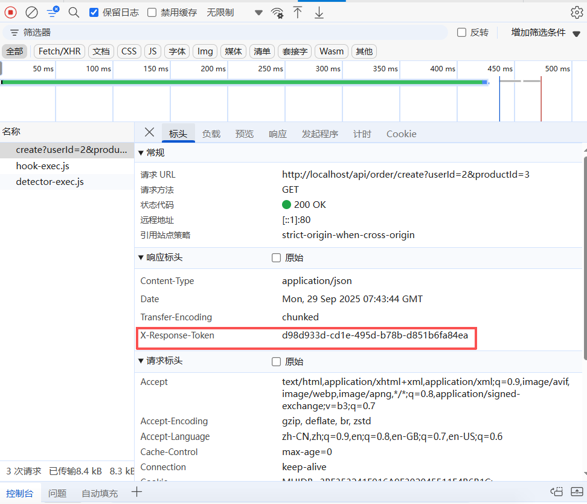

## 5.4. 全局跨域

如果需要配置跨域，可以在 Controller 的类上添加 `@CrossOrigin` 注解。

如果有许多 Controller，逐一添加注解太麻烦，可以在项目的配置类中添加 `CorsFilter` 类型的 Bean。

上述方法只适用于单体服务，那如果在微服务中呢？

借由 Gateway 的功能，可以在配置文件中轻松完成微服务的跨域配置：

```yaml
spring:
  cloud:
    gateway:
      globalcors:
        cors-configurations:
          '[/**]':
            allowed-origin-patterns: '*'
            allowed-headers: '*'
            allowedMethods: '*'
```

# 6. Seata

在微服务项目中，一个操作往往会涉及多个不同的服务，每个服务又会连接不同的数据库，比如订单服务中有订单的数据库，库存的服务有单独的库存的数据库等等。此时应该如何保证多个事务的统一提交和统一回滚呢？

[Seata](https://seata.apache.org/zh-cn/) 是一款由阿里巴巴开源的分布式事务解决方案，致力于在微服务架构下提供高性能和简单易用的分布式事务服务。

假设有一个采购（Business）的业务，它可以调用库存（Storage）和订单（Order）业务，订单业务调用账户（Account）业务。具体的逻辑是：用户采购了一件商品，对应的库存减一，并创建对应的订单，订单创建完成之前，还需将账户的余额扣减，才能完成订单创建，其中任何一个环节若出现数据库的回滚，则全部环节的数据库都需要回滚。

我们之前的非分布式微服务项目中，若要引入事务机制，只需要两个步骤：

1. 在主入口程序中加入 @EnableTransactionManagement 注解，以开启事务管理器。
2. 在对应需要加入事务的 Service 实现类中加入 @Transactional 注解。

若我们在分布式微服务项目中，依旧使用这种方式来开启事务回滚，可以吗？

不可以，这些 @Transcational 都是独立的，属于本地事务，你若是在各自的接口中单独测试这些事务，是没有任何问题的，出现了问题，这个小模块可以直接回滚，但是，我们是分布式微服务项目，所有的实例都不是独立的，而是相通的，不能单独回滚某一个实例，而是要回滚所有这一步操作涉及的数据库操作。显然，使用之前的方法是不行的。

Seata 引入了以下三者：

1. **TC(Transaction Coordinator) - 事务协调者**

   维护全局和分支事务的状态，驱动全局事务提交或回滚。

2. **TM(Transaction Manager) - 事务管理者**

   定义全局事务的范围：开始全局事务、提交或回滚全局事务。

3. **RM(Resource Manager) - 资源管理器**

   管理分支事务处理的资源，与 TC 交谈以注册分支事务和报告分支事务的状态，并驱动分支事务提交或回滚。

具体流程就是，全局事务如果要开始，业务的入口会开启一个 Global Transcation，在程序中就是在业务的入口的 Service 中的具体业务方法加入 @GlobalTransactional 注解，这样 TC 就知道这是一个全局事务，此后，这个方法中每调用一个远程微服务，就都是一个分支事务，这里的分支事务也会自动告诉 TC 自己的事务的状态，这样的话，如果某一个环节出现问题，TC 就会要求对该环节的事务进行回滚，而且，由于 TC 知道还有其他微服务分支事务，TC 便会要求其他所有事务也都需要回滚。

现在开始下载 [Seata](https://seata.apache.org/zh-cn/download/seata-server) ，下载后解压 Seata 后，进入 `bin` 目录，使用 `seata-server.bat` 命令启动 Seata。访问 http://localhost:7091/ ，账号密码均为 `seata` ，即可访问 seata 的控制台（我的 Seata 版本是 2.1.0，实测 2.5.0 的 Seata 不能进入控制台）

下载的 Seata 版本保证与 pom 文件中引入的 `spring-cloud-alibaba-dependencies` 依赖中的 Seata 版本一致。

在需要使用分布式事务的模块中添加依赖：

```xml
<!--seata 依赖-->
<dependency>
    <groupId>com.alibaba.cloud</groupId>
    <artifactId>spring-cloud-starter-alibaba-seata</artifactId>
</dependency>
```

在需要使用 Seata 的模块中添加 Seata 的配置文件 `file.conf` ：

```
service {
  #transaction service group mapping
  vgroupMapping.default_tx_group = "default"
  #only support when registry.type=file, please don't set multiple addresses
  default.grouplist = "127.0.0.1:8091"
  #degrade, current not support
  enableDegrade = false
  #disable seata
  disableGlobalTransaction = false
}
```

后续这个 file.conf 也可以不写，配置在 Nacos 服务器中即可。

最后在最顶端的方法入口上使用 `@GlobalTransactional` 注解，由此开启全局事务（注意，所有其他需要独自实现事务的方法，需加上之前所说的@EnableTransactionManagement 和 @@Transactional 注解）

至此，就完成了使用 Seata 控制事务的需求。

再详细说一下 Seata 的原理：

只要一个方法标注了 @ GlobalTransactional 注解之后，代表全局事务就开启了，方法一开始执行，就会向 TC 服务器，即 seata-server 事务协调者，注册一个全局事务，会生成全局事务的一个唯一 ID，称之为 XID，然后全局事务就开始了，所有的分支事务都结束了，全局事务才能结束。我们的全局事务就两件事：一是扣减库存，二是创建订单（订单中会先扣减余额），其实里面包含了三个各自的分支事务。Seata 把整个数据库事务分为两个阶段：

+ 第一阶段

  1. 解析 SQL 

     只是解析我们的业务 SQL ，并不执行。详细的解析就是在下一步。

  2. 查询前镜像

     这里的查询前镜像，值得就是查询我们要执行 SQL 之前的数据是怎么样的，比如我们的 SQL 是要修改某一条数据，就先查出来这条数据。这样就会得到一个前镜像。

  3. 执行业务 SQL

     再去执行我们的真正的 SQL 。

  4. 查询后镜像

     查询我们执行 SQL 之后，改变得数据，就得到了一个后镜像。

  5. 插入回滚日志

     给 undo_log 表中插入前后镜像组成得回滚日志。

  6. 向 Seata 注册分支事务

     代表我这个分支正在执行事务，申请该表的 1 号记录的全局锁，这个锁的目的就是防止外界再次修改这条刚刚修改的数据。

  7. 本地事务提交

     业务数据 + undo_log 一起保存

  同样的道理，所有的分支事务都要执行一遍这个一阶段的上述流程（本地事务提交 + undo_log 的提交）。

  8. 汇报给 Seata 自己提交成功与否结果

     等所有分支事务都完成这一流程之后，就会汇报给 Seata 具体的成功与否情况。

+ 第二阶段

  假设在一阶段中，存在分支事务报告自己失败了，即需要回滚，就会执行这第二阶段：进行全部回滚。若在第一阶段中，所有分支事务都成功了，那会执行提交的第二阶段：分支提交。

  + Case 1 ：全部成功

    1. 收到 TC 的提交请求，立即响应 ok
    2. 给异步任务队列中添加异步任务
    3. 异步和批量地删除响应的 undo_log 记录

  + Case 2 ：存在失败

    收到 TC 的回滚请求，开启下一个本地事务：

    1. 找到 undo_log 记录（通过 XID，Branch ID）
    2. 数据校验（后镜像与当前数据）如果不一致，则说明被其他渠道修改了，需要配置相应策略，如果一直则说明一切 ok，就差回滚
    3. 回滚数据（获取 undo_log 前镜像内容），执行修改，完成后删除 undo_log

这就是 Seata 的二阶段提交协议的流程。


最后，说一下 Seata 的四种事务模式，即：

1. AT 模式
2. TCC 模式
3. Saga 模式
4. XA 模式

首先说 AT 模式，这个模式意思是 自动模式，默认我们现在使用的都是 AT 自动模式。所有东西由 Seata 控制管理，这也是 Seata 所推荐的模式。

其次是 XA 模式，它也是二阶提交协议，只不过它是接受了数据库的 XA 协议。这里的数据库的 XA 协议，在我们的 Seata 中体现于第一阶段提交，若是 XA 协议，数据库在第一阶段，并不会真正提交，而是会阻塞住请求，只有在第二阶段确认要提交之后，才会真的去提交。性能会比较低下。优势是 XA 协议被主流关系型数据库广泛支持。开启 XA 模式，只需要在配置文件中配置：`seata.data-source-proxy-mode=XA`，即可。并不推荐这样

再说 TCC 模式，这个模式是全手动模式的二阶提交协议。

最后是 Sage 模式，是长事务的解决方案，有些全局事务，不是一会就能完成的，可能需要好几天，时间一长，就不适合使用其他模式了（会产生锁，时间越长，对系统影响越大），这个 Saga 模式就适合。Sage 结合了消息队列。
